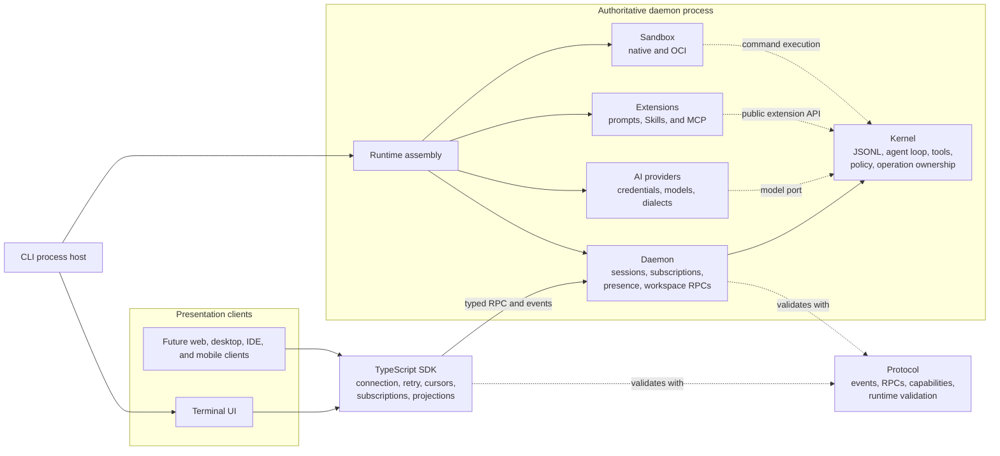

<!-- SPDX-FileCopyrightText: 2026 Hari Srinivasan -->
<!-- SPDX-FileCopyrightText: 2026 Lokesh -->
<!-- SPDX-FileCopyrightText: 2026 Srihari -->
<!-- SPDX-License-Identifier: Apache-2.0 -->

# Axl

Axl, short for Axolotl, is a local-first agent harness for developers who want one durable coding session across multiple clients without giving each client its own agent runtime.

A single daemon owns the session, model loop, tools, policy, and canonical event history. Clients connect through a typed protocol and shared SDK. They render the same state and submit user intent, but they do not become independent agents.

> **Project status:** Axl is under active development and has not published its first release. Roadmap phases 0 through 4 are complete. The TUI, prompt templates, Agent Skills, MCP support, native Linux hardening, and local OCI execution were brought forward from later phases. Web, desktop, mobile, hosted relay, and broader provider work remain planned unless explicitly marked implemented.

## Who Axl is for

Axl currently fits developers who want:

- a terminal coding agent with durable, resumable sessions
- model and provider code separated from the agent kernel
- sandboxed file, shell, and web tools with fail-closed isolation
- explicit control over steering, follow-ups, interruption, and detachment
- Agent Skills and MCP support without moving those features into the kernel
- a typed SDK for building another client over the same daemon
- auditable JSONL history and deterministic replay rather than client-owned chat state

Axl is not yet a hosted service, remote collaboration product, browser application, mobile application, or general workflow engine. Those surfaces are documented where planned, but they are not silently represented as shipped features.

## What works today

| Area | Current capability |
| --- | --- |
| Sessions | Create, list, resume, fork, clone, interrupt, detach, reconnect, compact, configure, and dispose |
| Durability | Append-only canonical JSONL, operation IDs, crash-safe mutation journal, restart reconciliation, and deterministic replay |
| Multi-client behavior | Independent attachments, paged snapshots, acknowledged cursors, presence, reconnect recovery, and shared deterministic projection |
| Automation | One-shot text and canonical JSONL output with `axl print` and `axl json`, plus native daemon RPC with `axl rpc` |
| Model interaction | Provider-grouped text-model catalog, provider-qualified model selection, authentication management, usage and costs, streaming text and reasoning, tool calls, steering, and follow-ups |
| Built-in tools | `read`, `write`, `edit`, `bash`, `web_fetch`, and `web_search` |
| Extensions | Public extension API, prompt templates, Agent Skills, and MCP 2025-11-25 over stdio and Streamable HTTP |
| Workspace review | Bounded file listing and reads, Git status, structured diffs, and daemon-owned last-turn checkpoints |
| Terminal UI | Multiline editor, history, themes, model controls, tool rendering, image attachments, regular scrollback mode, and fullscreen mode |
| Isolation | Bubblewrap, Landlock, seccomp, and rlimits on Linux; Seatbelt on macOS; optional rootless Podman or Docker execution |
| Safety | Path canonicalization, symlink-escape rejection, secret redaction, bounded protocol messages, and fail-closed sandbox selection |

## Prompt templates

Put reusable Markdown prompts in `~/.axl/prompts/` or `.axl/prompts/`. Project templates override global templates with the same filename. Run `/prompt` to browse them or `/prompt <name> [arguments]` to expand one into the editor for review before sending. Templates reload with `/reload`.

```markdown
---
description: Review one file
usage: "<path> [focus]"
---
Review {{1}}. Focus on {{2=correctness}}.
```

Use `{{1}}` through `{{99}}` for quoted positional arguments, `{{all}}` for every argument, and `{{1=default}}` or `{{all=default}}` for defaults.

## User themes

Put Axl theme JSON files in `~/.axl/themes/` or `.axl/themes/`. Project themes override global themes with the same ID. Select one with `/theme <id>`. Axl reloads changed theme files while the TUI is running, retains the last valid palette after an invalid edit, and reports the validation error. Use `/reload` after creating a theme directory during an active session. See [`packages/tui/README.md`](packages/tui/README.md) for the format and color roles.

## Architecture



The boundaries are deliberate:

- **Protocol:** `packages/protocol` owns event schemas, RPC schemas, capabilities, versioning, and trust-boundary validation. It has no runtime dependencies.
- **Kernel:** `packages/kernel` owns canonical history, the agent loop, tool execution protocol, cancellation, operation ownership, prompt queues, policy, and extension-host lifecycle. It depends only on the protocol and Node.js built-ins.
- **Daemon:** `packages/daemon` owns live sessions, subscriptions, presence, idempotency, persistence coordination, workspace APIs, and concurrent client access.
- **SDK:** `packages/sdk` owns typed requests, capability checks, transport reconnection, idempotent mutation retry, snapshot paging, cursor acknowledgement, gap recovery, and deterministic client projection.
- **Runtime:** `packages/runtime` assembles providers, tools, extensions, and sandbox implementations for the daemon process.
- **Clients:** presentation packages render SDK state and submit intent. They do not own model loops, tools, policies, queues, persistence, or canonical events.
- **CLI:** `packages/cli` selects placement, starts or connects to the daemon, gathers provider configuration, and launches the selected client.

The canonical order is always:

1. A client submits typed user intent.
2. The daemon validates capability, policy, and operation ownership.
3. The kernel performs the operation.
4. The canonical event is appended before derived state changes.
5. Every subscribed client receives and projects the same event.

See [Client authority and adapter boundaries](docs/architecture/client-boundaries.md) for the complete ownership rules.

## Sessions, detach, and reconnect

A session belongs to the daemon, not to the terminal that created it. Closing a client attachment does not cancel accepted work.

- `/detach` closes the TUI attachment and leaves the session running.
- `/quit` interrupts work, flushes history, shuts down the daemon, and exits. It asks for confirmation when other sessions or clients are affected.
- Escape interrupts without exiting. Ctrl+C clears the draft; a second press within 500 ms quits. Ctrl+D quits when the draft is empty.
- `axl daemon status`, `stop`, and `restart` provide explicit upgrade recovery. See [daemon lifecycle](SETUP.md#daemon-lifecycle-and-upgrade-recovery).
- `axl -r` opens the all-placement resume picker.
- `axl <session-id>` resumes a known session directly.
- `session.interrupt` is the explicit cancellation operation.
- `/request` shows or changes the daemon-owned output ceiling and HTTP idle timeout. The default output ceiling is the model maximum, fitted to available context; the idle timeout is five minutes and refreshes on response bytes.
- Daemon restart recovery reconciles accepted operations against canonical history before serving clients.

Resume uses a frozen, paged snapshot followed by an acknowledged live event stream. The SDK rejects altered duplicates, detects gaps, and replaces a projection from an authoritative snapshot when a cursor cannot be resumed safely.

### Steering, follow-ups, and queued prompts

While a model turn is active:

- **Enter** submits steering. It is inserted at the next model boundary after the current complete tool-call batch.
- **Alt+Enter** submits a follow-up. It runs when the turn would otherwise finish.
- Multiple steering messages remain FIFO with other steering messages.
- Multiple follow-ups remain FIFO with other follow-ups.
- Steering has priority over follow-ups at each model boundary.

Durable queued prompts use the daemon's canonical queue lifecycle. They are recorded before acknowledgement and are visible to every attachment. Pending durable queue items become paused after daemon restart and require explicit re-queueing, so Axl never guesses whether deferred work should run again.

## Installation

Axl requires Node.js `^22.19.0` or `>=24`. Native sandboxed execution requires Bubblewrap on Linux. Axl installs its pinned Landlock launcher dependency. macOS uses Seatbelt. Local OCI execution optionally uses rootless Podman or Docker with seccomp and cgroups v2.

Axl has not published its first release yet. After the first release passes the gate in [RELEASES.md](RELEASES.md), install from npm:

```bash
npm install --global @observal/axl
```

Or install a checksum-verified GitHub release artifact:

```bash
curl -fsSL https://github.com/Observal/Axl/releases/latest/download/install.sh | sh
```

Install a specific release by setting `AXL_VERSION`:

```bash
AXL_VERSION=v0.1.0 \
  curl -fsSL https://github.com/Observal/Axl/releases/download/v0.1.0/install.sh | sh
```

For development from this repository:

```bash
git clone https://github.com/Observal/Axl.git
cd Axl
pnpm install --frozen-lockfile
pnpm run install:cli
```

## Quick start

Inspect providers, authenticate one, choose its model, and start a session:

```bash
axl providers
axl models openai
axl login openai api_key
axl
```

The `provider` and `model` startup options select a canonical pair for a new session. In the TUI, use `/model` to choose a grouped provider and model pair.

Common entry points:

```bash
axl -r                          # choose a saved session
axl <session-id>                # resume a known session
axl --cwd ~/code/project        # choose the workspace
axl --profile exec              # expose only sandboxed Bash
axl --no-web-fetch              # disable one web tool
axl --no-web-search
axl --no-web                    # disable both web tools
axl doctor                      # inspect local sandbox support
axl daemon                      # run the daemon in the foreground
axl print "describe this repo"  # print one headless response
axl json "describe this repo"   # stream canonical events as JSONL
axl rpc                         # bridge JSONL RPC over stdin and stdout
```

The CLI connects to the matching local daemon and starts one in the background when necessary. Native, OCI, and unsafe placements use separate state and are labeled in the resume picker.

## Model providers

Use `axl providers` for explicit authentication and catalog status, `axl models` for grouped text models, `axl login` and `axl logout` for stored authentication, and `axl refresh` for explicit dynamic-catalog refresh. These commands report actionable authentication, entitlement, region, catalog, model, and configuration failures.

Inside the TUI, `/model` selects a provider-qualified model. `/providers`, `/login`, `/logout`, and `/refresh` expose the same daemon-owned operations. Escape cancels an active provider operation. The editor reports last-turn and cumulative token usage and USD cost when available.

Provider secrets never pass through daemon RPC or SDK projection.

1. The daemon owns provider and session operations.
2. `packages/ai` owns provider-specific credentials, authentication, model metadata, API dialects, and request behavior.
3. The trusted CLI process-host adapter renders provider prompts and collects answers inside the daemon process.
4. Login RPC carries only the provider ID and login method.
5. Authorization launch is restricted to HTTPS URLs without embedded credentials.
6. Canonical events, SDK cursors, catalogs, and client projections never contain credential values, OAuth codes, or prompt answers.

Provider listing is offline and side-effect free. Authentication status and catalog refresh are separate explicit operations. API dialect is model metadata, not user-selectable configuration. See [`docs/provider-support/product-integration.md`](docs/provider-support/product-integration.md) for the complete boundary and workflow record.

## Session profiles

Profiles are selected when a session is created and are enforced by the daemon.

| Profile | Purpose |
| --- | --- |
| `standard` | Normal coding session with the configured built-in tools and extensions |
| `minimal` | Small tool surface for focused work |
| `chat` | Tool-free conversation |
| `exec` | Bash-only session with no Skills, MCP servers, file tools, or web tools |

The [`exec` profile](docs/session-profiles.md) does not make an unsafe session safe. Isolation and tool exposure are separate controls.

## Built-in tools

The standard session exposes:

- `read`: bounded file reads under daemon policy
- `write`: atomic writes under daemon policy
- `edit`: exact replacement under daemon policy
- `bash`: commands executed through the selected sandbox
- `web_fetch`: bounded public HTTP and HTTPS retrieval
- `web_search`: DuckDuckGo Instant Answer by default, or Brave Search when configured

`web_fetch` blocks private and reserved destinations, limits redirects and response size, and returns readable or raw text. Set `BRAVE_SEARCH_API_KEY` to use ranked Brave Search results.

## Terminal client

The TUI supports:

- Unicode-aware multiline editing, selection, undo, kill-ring operations, clipboard paste, and external-editor handoff
- searchable command and prompt history
- regular terminal scrollback and persistent fullscreen presentation
- model, thinking-level, theme, detail, and tool-output controls
- live text, reasoning, activity, and tool status
- retained tool call/result cards with bounded output and diff previews
- image attachment upload and terminal-aware image rendering
- session resume, fork, clone, compact, reload, review, and status flows
- MCP approval, browser authorization, and structured-input dialogs
- optional Vim editing, prompt stash, model favorites, attention bell, and developer panel

Run `/commands` for available actions and `/hotkeys` for keyboard controls.

## Sandboxing

Axl refuses to run model-selected commands when required isolation is unavailable.

### Native Linux

The native Linux backend combines Bubblewrap namespaces and mounts, Landlock filesystem mediation, a versioned seccomp policy, dropped capabilities, private runtime directories, and resource limits.

### macOS

The native macOS backend uses Seatbelt and reports unavailable controls explicitly.

### OCI

Pull an image yourself and pass an immutable digest:

```bash
podman pull docker.io/library/bash:5.2.37
axl --sandbox podman \
  --image docker.io/library/bash@sha256:<64-hex-digest>
```

Replace `podman` with `docker` to use Docker. Axl never pulls an image implicitly and rejects mutable tags.

### Unsafe mode

```bash
axl --unsafe
```

Unsafe mode disables operating-system isolation and file-tool path policy. Commands and extensions run with the user's host access. Unsafe sessions use separate state under `~/.axl/unsafe/`, record their unenforced status, and remain visibly labeled.

See [Local sandbox backends](docs/architecture/sandbox-backends.md) and [Security policy](SECURITY.md).

## SDK and client development

`@axl/sdk` is currently private and in-tree. It provides:

- typed `request(method, params)` results from the protocol method map
- capability negotiation and exact wire-version checks
- idempotency keys and safe retry for eligible mutations
- resumable subscriptions with frozen snapshot paging
- acknowledged opaque cursors and authoritative gap recovery
- transport-independent connection contracts
- a Unix-socket adapter
- a deterministic conversation and activity projector
- provider-neutral model metadata for presentation clients

A new client should use the SDK rather than parse wire messages or reduce canonical events itself. Platform transports, authentication mechanisms, and cursor stores implement shared contracts as separate adapters. The daemon remains the authority regardless of client platform.

Browser, desktop, IDE, Android, and iOS clients are planned. The current browser architecture and security contracts are specified, but no `packages/web` application is implemented yet.

## Extensions

First-party and third-party features use the same public extension API. Extensions declare capabilities before activation and receive no private kernel imports. Disabling an extension removes its prompt content, UI, listeners, and background work.

Implemented first-party integrations include:

- Prompt template discovery, argument expansion, and editable review
- Agent Skills discovery, validation, and progressive loading
- MCP 2025-11-25 over stdio and Streamable HTTP
- capability-scoped terminal commands, shortcuts, widgets, lifecycle listeners, and tool renderers

## Package map

| Package | Responsibility |
| --- | --- |
| `packages/protocol` | Dependency-free canonical event, wire, RPC, capability, and validation contracts |
| `packages/kernel` | Event log, replay, agent loop, tool protocol, cancellation, queues, policy, and extension-host lifecycle |
| `packages/ai` | Provider contracts, credentials, model metadata, thinking policy, dialects, and Azure OpenAI support |
| `packages/daemon` | Authoritative sessions, operation coordination, subscriptions, presence, workspace RPCs, and Unix-socket server |
| `packages/sdk` | Typed client, reconnect and retry behavior, subscriptions, cursors, and deterministic projections |
| `packages/runtime` | Provider, tool, extension, and sandbox assembly for the daemon process |
| `packages/sandbox` | Native and OCI operating-system confinement |
| `packages/cli` | Process startup, placement selection, provider setup, and client launch |
| `packages/tui` | Interactive terminal presentation over the public SDK |
| `packages/extensions/prompts` | Prompt template discovery and editor expansion |
| `packages/extensions/skills` | Agent Skills integration |
| `packages/extensions/mcp` | MCP integration |

## Architecture specifications

- [Client authority and adapter boundaries](docs/architecture/client-boundaries.md)
- [Architecture decisions](docs/architecture/decisions.md)
- [Local web client architecture](docs/architecture/web-client.md)
- [Wire protocol and TypeScript SDK](docs/architecture/web-protocol.md)
- [Mutation and event delivery](docs/architecture/web-delivery.md)
- [Workspace and Git RPC](docs/architecture/workspace-rpc.md)
- [Web gateway security](docs/architecture/web-gateway-security.md)
- [Web build and packaging](docs/architecture/web-packaging.md)
- [Local sandbox backends](docs/architecture/sandbox-backends.md)

## Project documents

- [Setup](SETUP.md)
- [Session profiles](docs/session-profiles.md)
- [Development guide](docs/DEVELOPMENT_GUIDE.md)
- [Product vision and implementation roadmap](ROADMAP.md)
- [Repository structure](CODE_STRUCTURE.md)
- [Open-source policy](OPEN_SOURCE.md)
- [Release guide](RELEASES.md)
- [Contributing](CONTRIBUTING.md)
- [Security policy](SECURITY.md)
- [Governance](GOVERNANCE.md)
- [Code of conduct](CODE_OF_CONDUCT.md)

## Development

```bash
pnpm install --frozen-lockfile
pnpm build
pnpm typecheck
pnpm lint
pnpm format:check
pnpm test
pnpm check:boundaries
pnpm check:generated
pnpm audit --audit-level high
reuse lint
```

Run `pnpm check` for the normal local build and test gate. See the [development guide](docs/DEVELOPMENT_GUIDE.md) for focused commands and contribution workflow.

## License

Axl is licensed under Apache-2.0. See [LICENSE](LICENSE) and [NOTICE](NOTICE).
