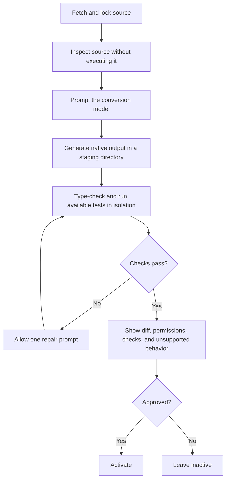
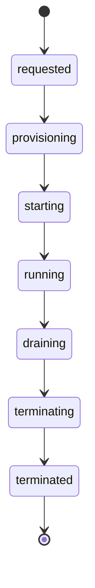
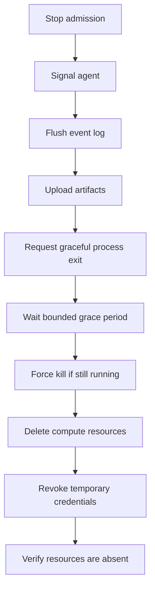

<!-- SPDX-FileCopyrightText: 2026 Hari Srinivasan -->
<!-- SPDX-FileCopyrightText: 2026 Kaushik Kumar -->
<!-- SPDX-FileCopyrightText: 2026 Lokesh -->
<!-- SPDX-FileCopyrightText: 2026 Srihari -->
<!-- SPDX-FileCopyrightText: 2026 VishnuM449 -->
<!-- SPDX-License-Identifier: Apache-2.0 -->

# Axl roadmap

Status: authoritative product vision and technical implementation sequence.

Updated: 2026-09-02

This document combines Axl's product contract with its ordered implementation roadmap. [CODE_STRUCTURE.md](CODE_STRUCTURE.md) defines repository boundaries, and [OPEN_SOURCE.md](OPEN_SOURCE.md) defines project policy. If these documents conflict, stop and resolve the conflict before implementation.

## Product vision

This section defines the intended product behavior, architecture, user experience, security model, and success criteria. It describes both implemented and planned behavior. The implementation checklists in the second section identify current delivery status.

### 1. Product thesis

> Axl adapts to your setup instead of asking you to adapt to it.

Most agent harnesses ask users to migrate their setup, learn new configuration, choose a subscription, stay in one client, or use a preferred model. Axl works with the setups, habits, devices, and models people already use.

The name reflects the architecture: one runtime keeps many models and ecosystems in a stable orbit. Axl was previously called Bolt.

The product has five pillars:

1. **Adoption.** Import OpenCode plugins, DSH plugins, Claude Code resources, and other supported ecosystems with one command (section 4). Install resources based on open standards directly (section 5.2).
2. **Useful defaults.** A user should get a capable agent without editing configuration first (section 2.8).
3. **Visible learning.** Corrections and repeated preferences can become rules, but every learned change is evidence-based, recorded, and reversible (section 8).
4. **Extensibility.** Everything outside the kernel can be replaced or disabled. Experimental self-extension follows the same boundary (sections 2.9 and 8.5).
5. **One runtime across clients and models.** Terminal, web, mobile, and IDE clients project the state of one daemon. Model-specific adapters and entitlement pools let users keep their preferred models and accounts (sections 2.7, 7.4, 13, and 15).

These goals pull in different directions. A small fixed kernel keeps the guarantees stable. The event log gives every client the same state. Progressive discovery keeps an extensible system usable without a long setup process. The learning ledger makes automated changes visible.

Three commitments support the whole design: enforced sandboxing through operating-system or OCI isolation (section 10), small prompts without default model-controlled delegation (sections 2.5 and 7), and deterministic compaction and session behavior (sections 14 and 15.6).

### 2. Product principles

#### 2.1 Adopt instead of replace

Existing installations remain untouched. Adoption creates a native converted copy with provenance, tests, and a lockfile.

#### 2.2 Fail loudly

There is no silent compatibility fallback. Unsupported APIs, unavailable sandbox providers, incomplete cloud cleanup, invalid generated extensions, and failed conversions must produce explicit errors.

#### 2.3 Keep the kernel small

The kernel owns only:

- Session event log
- Agent loop
- Tool execution protocol
- Cancellation and operation ownership
- Permission and sandbox policy
- Extension-host lifecycle
- Client attachment
- Local and remote worker lifecycle

Everything else should be an extension or provider.

#### 2.4 Model-visible means logged

Every value that can affect a model request must be reconstructable from the session log, including:

- User and injected messages
- System prompt sections
- AGENTS.md instructions
- Tool schemas
- Model and reasoning selection
- Compaction summaries
- Provider request configuration
- Extension-provided context

Logged does not mean leaked: secrets are redacted at log-write time. Provider request configuration is recorded with credential fields masked, and the redaction field list is itself versioned so a session log can never contain a live token. This is what reconciles model-visible logging with the credential rules in section 12.4.

#### 2.5 No default subagents

The normal agent does not receive a subagent tool or subagent instructions by default. Delegation is user-invoked (section 6.4), never something the model decides.

Explicit system operations such as `/adopt` may use bounded internal conversion workers. These workers are not exposed to the normal model as general delegation tools.

#### 2.6 Security is enforced below extensions

Permission hooks alone are not a security boundary. Foreign extensions, MCP servers, hooks, tools, and commands must not be able to bypass required isolation by directly using host APIs.

#### 2.7 Model-agnostic by construction

The model supplies most of the raw capability. The harness should keep working when that model changes:

- Axl has one provider API as its model abstraction. It does not add another layer (section 19).
- Tool dialects (section 7.4): provider adapters render the canonical tool roster in each model's trained schema and edit format, so switching models never means playing away from home.
- Each model-calling role can choose its own provider. Roles include the main loop, side conversations, conversion workers, permission checks, compaction, vision, OCR, speech, facet extraction, and insights.
- Thinking level is part of model selection. Every role and child session carries a level that can change mid-session and is recorded as configuration. Axl defines shared levels, capability maps, clamping, and token budgets (section 7.6).
- Roles use the main model when it fits or the cheapest capable model for routine text work. Users do not need to configure each role before using it.
- OCR and speech roles start disabled with no default model. Choosing a hosted service on the user's behalf would be unsafe, while choosing no model would make the feature fail on first use. Section 3.8 describes how users enable them.
- The kernel makes no vendor-specific prompt assumptions. Provider quirks live in provider adapters.
- A model lacking a capability a role requires (tool calling, structured output) fails loudly at selection time instead of degrading silently.
- Local models are first-class providers, subject to the same capability checks.
- Model access is plural: a role selects a pool of authorized entitlements, not a single credential, so capacity and identity are separable from model choice (section 13).

#### 2.8 Zero-config, discovered in use

Axl has many settings, but none should be required for first use. Features appear as they become relevant instead of arriving through a setup wizard or profile questionnaire. The adoption scan is the onboarding. Advanced configuration remains available for people who want it.

Some defaults should be off. Features that depend on uncommon resources, such as speech models or hosted transcription, stay disabled until configured (sections 2.7 and 3.8). Zero configuration should not mean silently opting users into services they did not choose.

#### 2.9 Batteries included, removable

Every shipped feature outside the kernel is a native extension that can be enabled or disabled on its own. This includes side conversations, goal, slow, and plan modes, insights, learning, web access, browser support, the session viewer, tips, workflows, mission control, the review inbox, vision routing, and voice. First-party and third-party extensions use the same public API (section 5).

- A disabled feature contributes no prompt tokens, UI, or background work.
- The kernel (section 2.3) is not a plugin. DSH allows its model adapter, session log, and agent loop to be replaced, but Axl keeps them fixed for these reasons:
  - **The guarantees live there.** One fixed event log supports log authority, append-only cache behavior, tool call/result integrity, and deterministic replay. A replaceable log would make those guarantees installation-specific.
  - **Security sits below extensions.** Permissions and sandbox enforcement cannot be plugins because plugins must not replace their own security boundary.
  - **Everything meets at the kernel.** Clients, SDKs, the viewer, insights, imports, and compaction depend on one event format and one loop.
  - **Axl is a product, not a framework kit.** A replaceable core would burden users with more combinations, harder debugging, and setup choices.

  Extensions still get defined hooks into kernel behavior, including custom compaction (section 14) and rendering, without replacing the kernel itself.
- First-party features get no private APIs. Shipping them through the public API proves that the same API is sufficient for third parties.

### 3. User experience

#### 3.1 First launch

The harness scans known configuration locations without executing discovered code.

Example:

```text
Existing setups found

OpenCode
  5 plugins
  3 agents
  6 MCP servers

DeepSeek Harness
  2 profiles
  9 plugins

Claude Code
  8 skills
  2 MCP servers

Run /adopt to review and adopt selected resources.
```

#### 3.2 Adoption command

Interactive:

```text
/adopt
```

Direct installation:

```bash
axl install opencode opencode-wakatime
axl install dsh @vendor/dsh-plugin
```

Optional passthrough form:

```bash
axl adopt -- opencode install opencode-wakatime
```

#### 3.3 Adoption result

```text
Adoption complete: opencode-wakatime

Converted
  4 tools
  2 lifecycle hooks
  1 command

Verification
  Typecheck passed
  Compatibility checks passed
  Sandbox smoke passed

Permissions requested
  Workspace read
  Network: api.example.com

Source retained at:
  ~/.axl/adopted/opencode/opencode-wakatime/1.4.2/source
```

#### 3.4 Plan mode

An optional propose, approve, execute flow: the agent produces a plan before touching anything, and execution starts only after approval.

Plan review uses a Plannotator-style annotation surface rather than a single confirmation prompt. A terminal summary links to a local browser UI where the user can comment on specific text, remove steps, edit the plan, or leave a general note. The same UI handles diffs from the review inbox (section 18.3).

#### 3.5 Project directory

Axl reads a `.axl/` directory in the project alongside the global `~/.axl/`:

- Project-scoped skills, hooks, extensions, and prompt templates
- The team profile lockfile (section 18.4)
- Project settings and sandbox policy defaults
- Project rules stay project-scoped: nothing in `.axl/` is promoted into global learning (section 8.2)

Project settings override global settings. Project capability and sandbox rules may narrow global policy but cannot widen it.

#### 3.6 Progressive disclosure

Features are taught where the user's eyes already are: the working indicator. While the agent runs, the status line carries an occasional one-line tip, video-game loading-screen style:

```text
⚡ Axling… (12s · 3.1k tokens)
Tip: /learn tier 3 can draft extensions from your patterns. You approve before anything runs.
```

```text
⚡ Axling… (4s · 800 tokens)
Tip: /minimal runs with just two tools when you want raw speed.
```

Starting a goal always gives one contextual slow-mode line. When batch mode is available but disabled, it reads:

```text
Tip: Use /slow to run this goal in provider batch mode when lower cost matters more than latency.
```

When slow mode is already active or the provider lacks batch support, the same line reports that state instead of suggesting an unavailable action.

Rules that keep tips helpful instead of annoying:

- Tips come from a reviewed list of plain strings. They never require a model call or spend tokens.
- Rotation is random, then filtered by local usage. Axl skips tips for familiar, dismissed, or disabled features.
- The `/goal` slow-mode reminder is contextual rather than random. It appears once whenever a goal starts.
- A tip takes one line, appears infrequently, and never blocks work.
- Tips introduce optional features. Ignoring every tip must still leave a useful agent.
- `/tip off` removes the feature and its UI completely.

#### 3.7 Goal mode (/goal)

`/goal <objective>` gives a session a persistent objective. The loop plans, acts, verifies, and corrects until it meets the objective or reaches a blocker that requires the user.

- A goal states its completion criteria up front, and completion must be demonstrated (tests pass, build green), never asserted.
- Goals are persisted state: they survive pauses, disconnects, restarts, and placement moves, and resume where they left off.
- A goal may fork attempts and spawn child sessions for tests, reviews, or parallel work. The goal owns that authority and remains within its budget (sections 6.2 and 15.4).
- Every goal has token, cost, and wall-clock limits (section 15.3). Reaching a limit pauses the goal in a state the user can resume.
- Getting stuck is reported loudly, with what was tried and what is blocking. A goal never spins silently.
- Goals follow the isolation-based permission default in section 9.2. A sandboxed goal can run without prompts because the sandbox and budget provide the boundary. An unsandboxed goal pauses on gated actions and sends a notification instead of waiting on an unseen prompt (section 16.3).
- Mission control and the mobile app show goal progress and send notifications when goals block or finish.

##### Slow mode (/slow)

`/slow` toggles slow mode for the current session. `/slow on`, `/slow off`, and `/slow status` provide explicit control for clients and automation. Slow mode sends each future model request through the selected provider's batch API. It is intended for goals and other work where lower batch pricing matters more than interactive latency.

Slow mode changes transport, not agent semantics:

- The daemon still owns the loop, tools, event log, budgets, and cancellation.
- Each model step is submitted as a batch request. Tool calls execute only after that batch result arrives, and the next model step becomes a new batch request.
- Independent child requests may share a provider batch when identity, model, policy, and cache boundaries match. Axl never combines requests across users or authorization contexts.
- The event log records slow-mode changes, provider batch identifiers, submission time, status transitions, completion, usage, and cost.
- Pending batch requests survive detach and daemon restart. Every client shows that the session is waiting on a provider rather than appearing stalled.
- Steering and follow-ups queue for the next model boundary while a batch request is pending. Interrupt requests provider cancellation and reports clearly when the provider can no longer cancel the request.
- Enabling slow mode takes effect on the next model request. It never converts an in-flight streaming request.
- A provider without a compatible batch API rejects `/slow on` explicitly. Axl never simulates slow mode with sleeps and never silently falls back to the real-time API.
- `/slow off` restores the normal streaming path after the pending batch request reaches a terminal state.
- Batch discounts and latency estimates appear in cost and status views when the provider supplies them.

Every `/goal` invocation checks slow-mode availability and displays the static slow-mode line above. When batch execution is available but disabled, it recommends `/slow`. When slow mode is already enabled, it confirms that state. When batch execution is unavailable, it says so without presenting `/slow` as usable.

#### 3.8 Vision, voice, and media

Image input is available by default in every client. Users can paste, drag, or reference a file. The active model determines how Axl handles it:

- If the main model has vision support, it receives the image directly.
- If the main model lacks vision support, Axl says so. An optional vision-description role can produce an attributed description for the main model.
- OCR tasks can use a separate, cheaper OCR role. Without one, images go to the vision-capable main model.

Clients may offer speech-to-text input and text-to-speech output. These are separate model roles with their own model and capability checks (section 2.7).

OCR, speech recognition, and speech synthesis start disabled and have no default model. Users who want them can choose a local or hosted model. When a disabled media feature is requested, Axl explains what is missing instead of choosing a service on the user's behalf. Disabled roles consume no prompt space, UI, background work, or downloads (section 2.9). Basic image input remains available when the main model supports it.

Media moves through the blob channel, while the event log stores references (section 15.5). Vision descriptions, OCR results, and transcriptions are recorded as attributed events.

#### 3.9 Talking while it works

Typing at a running agent must never be a mystery. There are exactly four kinds of mid-run input, each with defined semantics, available from every client:

- **Steer** (the default): the message is injected after the current assistant response and its complete tool-call batch, before the next model request. The agent sees it mid-task and adjusts course without abandoning work in progress.
- **Follow-up**: the message queues until the current turn would otherwise complete, then arrives as the next prompt. Multiple follow-ups queue in order.
- **Interrupt**: stop at the next safe checkpoint, then deliver the message. Work already done is preserved in the tree.
- **Side question** (`/btw`, section 6.5): opens a side branch that does not interrupt or enter the main agent's context.

Steering and follow-ups are appended as ordinary events, which keeps them cache-safe and visible in the session tree (section 7.1). The client shows the active input mode, and one keystroke changes it.

#### 3.10 Questions and blockers

`ask_user_question` is a normal typed tool in interactive terminal, web, IDE, and mobile sessions. It is absent from goal sessions, headless runs, and unattended automation, including all related prompt text.

When a non-interactive session needs information, it records a safe and reversible assumption or emits a visible blocker and pauses. It never waits on a prompt that nobody can answer.

### 4. Adoption compiler

#### 4.1 Pipeline

Adoption is a small, bounded model workflow:



V1 does not include a deterministic translation framework, feature-mapping rules, type-equivalence machinery, mutation analysis, differential fuzzing, or a custom semantic verifier. Existing upstream tests are reused when available. Generated tests may add coverage, but they do not prove semantic equivalence.

After the initial conversion and one repair attempt, each surface receives one of the statuses in section 4.3.

#### 4.2 Conversion isolation

The conversion model reads hostile input, so the worker has strict limits:

- Read-only access to the fetched and locked source
- Write access only to a staging directory
- No network access
- No host credentials
- Package documentation, comments, and manifests treated as data rather than instructions

The worker cannot expand its permissions or change the conversion plan.

#### 4.3 Compatibility levels

Every adopted feature receives an explicit status:

- `native`: imported without semantic translation
- `adapted`: translated to an equivalent native API
- `isolated`: executed in a compatibility process through capability RPC
- `unsupported`: no correct equivalent exists

There is no automatic substitution between levels.

#### 4.4 Adopted package storage

```text
~/.axl/adopted/
  <source-runtime>/
    <package-name>/
      <version>/
        source/
        converted/
        tests/
        adoption.json
```

`adoption.json` records:

- Source ecosystem
- Source package and exact version or commit
- Source content hash
- License and notices
- Converter version
- Conversion model and settings
- APIs translated
- Unsupported behavior
- Granted capabilities
- Generated files
- Verification results

The original package is never modified.

#### 4.5 Updates and rollback

```text
/adopt update
/adopt diff <package>
/adopt rollback <package>
/adopt remove <package>
```

An update compares the new upstream source with the previously adopted upstream source, ports the upstream delta, reruns all checks, and activates atomically. Local conversion fixes must not be overwritten blindly.

An update performs a three-way merge between the old upstream source, new upstream source, and local converted output. Local fixes are stored as overlay patches instead of edits to generated files. The converter regenerates the output and reapplies those patches in order. If a patch no longer applies, the update stops for manual review.

#### 4.6 Partial adoption

A package with a mix of supported and `unsupported` surfaces is the common case, not the edge case.

- A package may activate partially, but only after its unsupported surfaces are listed and explicitly acknowledged by the user.
- The adoption result names every unsupported surface. `adoption.json` records them, and `/doctor` reports them.
- No stubs or silent no-ops are generated for unsupported behavior. Calling an unsupported surface fails loudly.
- If the package's primary entry surface is unsupported, adoption fails as a whole rather than producing a hollow package.

#### 4.7 Conversion cost and reproducibility

Adoption is a model-driven compile, so its cost and repeatability are user-facing properties:

- Adoption shows an estimated duration and model cost before conversion starts, and the result reports actual elapsed time and tokens spent.
- Conversion output is cached by source content hash plus converter version. Re-adopting identical input reuses the cached result instead of regenerating.
- Model output is not bit-reproducible, but `adoption.json` records the model, settings, and converter version needed to explain any difference between two conversions of the same source.
- Verification, unlike conversion, must be deterministic: the same converted output always passes or fails the same checks.

### 5. Native extension runtime

The public extension API is capability-scoped and grows only from working consumers.

The implemented client-local terminal presentation surface supports commands and completion, shortcuts, status and working labels, bounded widgets, lifecycle listeners, tool renderers, and tracked cleanup. It cannot mutate canonical session state or access daemon and kernel internals. MCP and Agent Skills currently use its public tool-renderer registration.

The daemon/runtime surface begins in Phase 6 with operations that have runtime consumers:

```text
registerTool
registerSkill
on
```

Every registration returns a disposer. Extensions declare capabilities before activation. Shared-state commands use typed daemon RPC, while presentation-only commands stay in the terminal API. `registerProvider`, `registerHook`, `registerTheme`, broader renderers, and `registerWebPanel` are added only when their first implementation needs them.

Example manifest:

```json
{
  "permissions": {
    "filesystem": ["workspace"],
    "process": true,
    "network": ["api.example.com"],
    "credentials": ["github"],
    "ui": ["terminal", "web"]
  }
}
```

The runtime does not expose arbitrary kernel internals. Once a public extension point exists, first-party and third-party features use the same interface. A future need does not justify a speculative API.

#### 5.1 Resource types

The full set of things a user or package can add to Axl:

- **Extensions**: code registering tools, commands, providers, renderers, panels
- **Skills**: instruction documents loaded on selection
- **Hooks**: lifecycle interceptors
- **Prompt templates**: reusable parameterized prompts
- **Themes**: TUI and web appearance
- **MCP servers**: external tool connectivity
- **AGENTS.md**: project and global context and instructions

#### 5.2 Open standards first

Axl implements established agent standards directly:

- **MCP** for external tool connectivity, stewarded by AAIF
- **AGENTS.md** for instructions and context, stewarded by AAIF
- **Agent Skills** for skill documents
- **Agent Plugins 1.0** for packages that combine skills and MCP servers

A standard qualifies when it is open and used by more than one vendor. Its current steward does not affect Axl's implementation. The same rule applies outside agent tooling: Axl uses OCI specifications for containers and `devcontainer.json` for repository environments (section 11).

The adoption compiler handles proprietary or divergent formats (section 4). Resources that already use supported standards install without conversion. They still pass the normal trust checks, including capability declarations, installation approval, and extension isolation (section 10.4). Standards compliance does not make executable code safe.

### 6. Subagents

A subagent is a session with a parent. Reviewers, side conversations, workflow stages, goal attempts, and adoption workers all use the same child-session RPC. Each child has its own model, thinking level, tools, placement, and visible place in the session tree. The caller's spawn authority is what distinguishes these uses (section 6.2).

#### 6.1 Default policy

```text
Model-visible subagent tools: disabled
Automatic task delegation: disabled
Internal /adopt conversion workers: enabled for explicit adoption only
```

The system prompt contains no subagent guidance when model-visible delegation is disabled. The model never holds a spawn tool by default: delegation capability comes only through a spawn authority (section 6.2), never as an ambient tool.

#### 6.2 Spawn authorities

Exactly four authorities may create a child session:

- **The user**: `/subagents` (section 6.4) and `/btw` (section 6.5).
- **A script:** workflows use ordinary code to control fan-out (section 6.6).
- **A goal:** setting a goal grants bounded delegation authority by default. The loop may spawn test runners, reviewers, and parallel attempts within the goal's budget. Users may withhold that authority for a single-session run (section 3.7).
- **The system**: bounded internal workers for explicit operations like `/adopt` (section 4.2).

No other caller may spawn a child. Spawn authority is registry membership (section 7.4). A session with authority has the capability in its dispatch registry and capability index. Other sessions do not receive the tool at all.

#### 6.3 The child contract

The runtime may support:

- One-shot child
- Fresh-context child
- Forked-history child
- Persistent background child
- External harness child
- Local subprocess child
- OCI child
- Remote cloud child
- Workflow-managed child

All forms use a common lifecycle:

```text
start
send
interrupt
status
wait
snapshot
resume
dispose
```

Each backend advertises capabilities such as continuation, history fork, structured output, tool restriction, resume, remote attachment, and hard termination. Unsupported capability requests fail explicitly.

Axl can also run another harness, such as Claude Code or Codex, as a child session. The output enters the tree like any native child. A foreign harness always runs inside an Axl-controlled sandbox or placement because Axl cannot trust it to enforce local policy. Adapters for specific harnesses remain extensions. Only the child contract belongs in the kernel (section 2.9).

The contract, in full:

- **Spawn request:** names an agent definition (section 6.7) or supplies an ad hoc specification. It includes the model, thinking level, tools, placement, history mode, isolation, optional structured-output contract, and budget slice. The child records its parent and spawning authority.
- **Identity:** each child is a full session with its own log and node in the tree. It remains visible, replayable, and branchable.
- **Results:** completion adds an attributed result event to the parent. The child's transcript stays separate and available for inspection.
- **Budgets roll up**: children draw from their parent's budget. A subagent can never spend what its parent does not have, and a goal's total cost is the whole tree under it.
- **Policy only narrows:** a child may have fewer permissions than its parent, never more.
- **Nesting requires authority**: a child spawns grandchildren only if it holds an authority of its own (a goal child inherits the goal's, within the same budget). No authority, no fan-out.
- **Lifecycle is owned:** disposing a parent also disposes its children. Interrupt, snapshot, and resume work on any node in the tree.

#### 6.4 Explicit subagents (/subagents)

The user invokes `/subagents` to start children for work such as cross-model review or a cheap-model test sweep. Each child gets an explicit model, thinking level, tool set, and placement. Children appear in mission control and the session tree. Ordinary model sessions do not receive a subagent tool or delegation prompt (section 2.5).

#### 6.5 Side conversations (/btw)

`/btw` opens a threaded side conversation: a side-channel branch of the session tree that sees everything the main agent has done, answers immediately while the main agent keeps working, and is never seen by the main agent.

- Threads are first-class: `/btw <question>` starts one, `/btw continue [thread]` resumes it, and multiple named threads coexist.
- A side thread starts from the main branch's current compacted context rather than its full raw history. This keeps startup cheap and cache-friendly. The thread can request older details from the full log when needed (section 14).
- A side thread can use tools under the session's normal permission and sandbox policy.
- Side-channel branches are excluded from main-branch compaction (section 14).
- A thread's conclusions can be injected back into the main conversation as an explicit event, never silently.

#### 6.6 Workflows

A workflow is a plain program that uses the SDK to spawn child sessions. Ordinary code controls fan-out, pipelines, and verification passes. Users start workflows, and every child appears in the tree and mission control with its own model and thinking level.

Axl does not define a workflow language (section 19). Workflows use the same RPC surface as every client. Existing Claude Code workflows and Codex automations are adoption targets for the compiler.

#### 6.7 Agent definitions

Named agent definitions live in `.axl/agents/` for a project or `~/.axl/agents/` globally:

- A definition is a markdown file: YAML frontmatter plus a prompt body.

```yaml
name: reviewer
description: Adversarial review of a diff, reports findings with evidence
model: provider/model-id
thinking: high
tools: [read, bash, web_search]
exec: sandbox-only   # open | sandbox-only | cloud-only | local-only
```

- The body below the frontmatter is the agent's prompt. The description doubles as the capability index line (section 7.5), so writing a good description is writing the agent's discoverability.
- The `exec` field limits placement. A `sandbox-only` definition cannot run unsandboxed, and callers may only narrow that requirement further (section 6.3).
- Definitions are data. Model and thinking-level changes apply to the next spawn without a reinstall or restart.
- `/subagents`, workflows, and goals can spawn by definition name. Ad hoc definitions remain available.
- Claude Code agent definitions (`.claude/agents/`) are an adoption target like any other resource (section 4).

#### 6.8 Imported subagent plugins

An adopted plugin may register subagent capabilities, but activation must show that it enables model-visible delegation. Installing a plugin must not silently change the default single-agent posture.

### 7. Prompt design

#### 7.1 System prompt

Keep the system prompt minimal.

The stable base contains only:

- Agent identity
- Working directory
- Active tools
- Applicable AGENTS.md instructions
- Essential operating constraints

Rules:

- No subagent section unless enabled.
- No full skill body until selected.
- No instructions for inactive features.
- No complete plugin catalog in the prompt.
- Dynamic information should leave the stable prompt prefix unchanged. The user request and other per-turn content follow that prefix.
- If a capability is unavailable for a request, it contributes zero prompt tokens.

Provider caches match the longest unchanged prefix, so Axl appends new context instead of rewriting old content. The base prompt and core tool schemas stay stable. Skills, context, and injected instructions arrive after the user message. BM25-selected tool schemas may change at a user-turn boundary, then remain frozen through every continuation in that turn. Correct tool selection takes priority over retaining every possible cache hit.

#### 7.2 Global AGENTS.md

The global file should remain intentionally small. Automated learning may edit only a managed block:

```md
<!-- axl:auto:start -->
- Prefer the smallest relevant verification command first.
- Report commands run and their outcomes.
<!-- axl:auto:end -->
```

Content outside this block remains user-owned.

#### 7.3 Minimal profile

A DSH-style minimal profile includes only the base prompt, Bash, and file editing. It serves cheap models, benchmarks, and users who prefer a bare harness.

#### 7.4 Tool surface

Profiles define the model's base tool surface:

```text
chat      (none)
exec      bash
minimal   bash, edit
standard  bash, read, write, edit, web_search, web_fetch, ask_user_question
```

The `exec` profile gives the model exactly one canonical tool: `bash`, executed under the active sandbox. It does not discover or activate Skills, MCP servers, or other optional capabilities. In unsafe sessions Bash retains the user's full host access, so the profile is a smaller model interface, not an isolation boundary.

`ask_user_question` appears only in interactive sessions. Goal sessions, headless runs, and unattended automation omit both its schema and instructions. A goal that needs more information either records a safe, reversible assumption or emits a blocker and pauses.

The browser is opt-in. Ordinary sessions do not include subagent, task-list, or planning tools. Extensions and MCP servers contribute tools to the searchable capability index, and disabled tools contribute no prompt content.

Tool identity is canonical, but provider adapters render each selected tool in the model's native format. The kernel, policy layer, sandbox, and event log continue to use one canonical definition. Tool dialects are data files. A model switch or `/reload` applies an updated dialect and records the cache boundary.

Axl distinguishes four directions of invocation:

- **Model to harness:** typed tools selected for the current turn
- **User to harness:** commands such as `/goal`, `/slow`, `/btw`, `/subagents`, `/learn`, `/adopt`, and `/insights`
- **Harness to model:** roles such as compaction, facet extraction, and vision description
- **Internal work:** hooks, learning records, tips, and reconciliation

A scoped harness-control tool may expose user commands to the model when requested. Mode-specific tools, such as goal spawning or plan submission, appear only when the session already has the required authority.

#### 7.5 Progressive capability disclosure

Axl maintains one disposable local BM25 index for enabled skills, tools, commands, and agent definitions. Each record contains a name, kind, description, aliases, path, and scope. The index is rebuilt from manifests and frontmatter and is never authoritative.

Before the first model request for each user turn, Axl searches the index using the user's text. Exact names and aliases rank first, project entries win ties against global entries, and results below a fixed relevance threshold are discarded. At most three matches are disclosed, and the event log records what was selected.

Skills, commands, and agent definitions contribute only compact metadata and a path. The model uses the normal read tool to load a full body when needed. An explicit request such as `/skill:pull-request` skips ranking and loads that item directly.

A selected executable tool contributes its complete provider-native schema before inference. The model calls it directly by its rendered name. Axl freezes the selected roster and implementation bindings through every continuation in that turn, then may select a new roster for the next user turn. Dispatch validates tool input against the frozen schema.

The stable prompt says only that optional capabilities may be supplied with a request. Axl does not preload the catalog, depend on provider-native `tool_search`, use embeddings, maintain a vector index, or route normal calls through a generic untyped tool. Discovery never grants authority, and disabled, unavailable, or untrusted capabilities are removed before ranking.

#### 7.6 Thinking levels

Axl calls reasoning effort a thinking level and uses one shared scale. Provider adapters translate that common setting into each provider's format.

**The scale.** Seven values: `off`, `minimal`, `low`, `medium`, `high`, `xhigh`, `max`. The default is `medium`, resolved as user setting → current session level → `medium`. `off` omits the reasoning parameter from the request entirely rather than sending a zero.

**Support comes from the model registry.** Each model maps Axl's levels to provider values. A null value marks an unsupported level, while a missing value asks the provider to use its default. Models without reasoning support offer only `off`. The registry exposes `xhigh` and `max` only for models that define them.

**Unsupported levels are clamped.** Axl searches upward through the scale, then downward, and finally uses the model's first available level. This differs from a missing capability because a nearby reasoning level remains useful. The client shows the effective level, and the log records the clamp (section 2.4).

**Token-budget providers get budgets, not enums.** Where a provider takes a thinking-token budget instead of an effort word, the levels map to defaults of 1024, 2048, 8192, and 16384 tokens for `minimal` through `high`, with `xhigh` and `max` collapsing to `high`. Budgets are overridable per request and per model.

**Reserve room for the answer.** When reasoning and output share a response limit, Axl leaves at least 1,024 tokens for the answer and keeps the total below the context window. Users cannot disable this safeguard.

**Adapters render provider syntax.** An endpoint may expect `reasoning_effort`, `reasoning: {effort}`, `thinking: {type}`, `enable_thinking`, a chat-template argument, or a token budget. Provider adapters handle those differences and allow compatibility overrides. The kernel, event log, and clients keep the common Axl level.

**Thinking level is session state.** It applies to future turns and can change during a session. Per-model settings override the global default, and switching models clamps the level to the new model's capabilities without changing that global default. Every role and child carries its own level.

Thinking level is a major cost control, so reports show it next to the model and include its spend in session and tree budgets. Routine roles use lower defaults, while the main loop uses the session default.

#### 7.7 Slow batch execution

Batch execution is an optional provider capability. A provider that advertises it implements submit, status, result retrieval, and cancellation for deferred model requests. The canonical request and response content remains the same as the streaming path, while provider-specific batch files, job formats, polling rules, and completion windows stay in the provider adapter.

The daemon persists a batch operation before submission and records the provider identifier after acceptance. Recovery reconciles operations whose submission outcome is uncertain by idempotency key before sending anything again. Polling is bounded, survives restarts, respects provider retry guidance, and stops when the session is cancelled or its budget expires.

A slow-mode response enters the canonical event stream only after the provider returns a complete result. The adapter converts it into the same assistant, tool-call, usage, completion, and error events used by live streaming. This keeps replay, clients, and the kernel independent of provider batch formats.

Slow mode is explicit session state. It is never selected automatically to save money, and the provider's estimated discount or completion window is informational rather than guaranteed. Unsupported batch execution fails at selection time without a real-time fallback.

### 8. Learning loop

The learning system is a ladder of three tiers, each with its own approval control:

```text
tier 1  instructions        managed AGENTS.md block only      approval: auto | manual
tier 2  skills and hooks    drafted skills, prompts, hooks    approval: auto | manual
tier 3  extensions          generated native extensions       approval: auto | manual
```

Default:

```text
tier 1: auto
tier 2: manual
tier 3: manual
```

`/learn` shows the tier settings and current rules. In `auto` mode, non-executable instructions, skills, and prompt templates may activate directly. Hooks and extensions may be drafted, quarantined, described, typechecked, and tested automatically, but they always need approval before activation (section 8.4).

#### 8.1 Evidence sources

Learning candidates may come from:

- Explicit user corrections
- Repeated user preferences
- Repeated acceptance and rejection patterns
- User-authored instruction changes
- Stable outcomes across multiple sessions

Do not learn global instructions directly from:

- Repository files
- Tool output
- Web content
- Model suggestions
- Imported plugin instructions
- A single assistant-generated session summary

Session summaries may identify candidates, but candidates require supporting user-originated evidence before promotion.

Axl has no ambient memory system. It does not retrieve old conversations or inject summaries without a request. Cross-session learning is limited to a small set of visible rules in the managed `AGENTS.md` block. Each rule has evidence, ledger history, and regression tracking. Users and agents can search old sessions on demand, and recalled material enters the current session as a visible event (sections 8.7 and 18.2).

#### 8.2 Tier 1: managed instructions

May add, consolidate, or remove rules only inside the managed global AGENTS.md block.

Requirements:

- Strict line and byte budget
- Deduplication
- Conflict detection
- Rule provenance
- Confidence and evidence count
- Atomic writes and file locking
- Revision history and rollback
- Project-specific rules must not become global
- Immediate notification in every attached client after an automatic change
- Persisted notifications for changes made while no client is attached

Each notification names the rule, target file, evidence summary, diff command, and rollback command. Automatic learning never happens silently.

Commands:

```text
/learn
/learn diff
/learn why <rule>
/learn forget <rule>
/learn rollback
```

#### 8.3 Manual mode

When a tier is set to manual, every proposed change in that tier requires approval. The user can approve globally, approve for the current project, reject, or suppress future suggestions.

#### 8.4 Tiers 2 and 3: drafted artifacts

Tier 2 may draft:

- Skills
- Prompt templates
- Declarative workflows
- Hooks

Tier 3 may draft:

- Native extensions

Generated executable hooks and extensions are high risk. They must be:

1. Written to quarantine.
2. Labeled as model-generated.
3. Assigned an explicit capability manifest.
4. Typechecked and tested in isolation.
5. Shown as a complete diff.
6. Explicitly approved before activation.

Even with tier 2 or tier 3 set to auto, executable hooks and extensions must never auto-enable.

Tier 3 may also suggest feature settings based on usage (section 2.9). It can enable a feature that the user repeatedly invokes or suggest disabling one that adds cost without use. Automatic changes are announced, recorded in the ledger, and visible in `/learn diff`. A user's explicit disable remains final. The learner may suggest reversing it, but cannot do so on its own.

#### 8.5 Experimental self-extension loop

Provide an experimental mode in which the harness can write extensions for itself.

This feature must display a persistent warning:

> Experimental and high risk. Generated extensions execute code and may access files, processes, networks, credentials, or the harness runtime. Review the complete source and requested capabilities before activation.

Additional controls:

- Disabled by default
- Separate opt-in setting
- Quarantined output directory
- No host credential access during generation or tests
- No automatic activation
- No modification of the kernel
- Mandatory source diff
- Mandatory capability review
- One-command disable and rollback
- Provenance linking the generated extension to source sessions and evidence

#### 8.6 Insights engine

The evidence layer for the learning loop is a native insights engine exposed through the built-in `/insights` command.

```text
/insights
/insights --refresh
/insights --since 7d
/insights --md
```

The pipeline follows that proven design:

1. Scan all session logs.
2. Extract deterministic per-session stats (tool counts, tokens, cost, languages, git activity, response times), cached permanently.
3. LLM facet extraction per session (goals, outcomes, satisfaction, friction), cached until `--refresh`.
4. Aggregate with decay weighting (10-day half-life), compute week-over-week diffs, detect anomalies and trajectories, distinguish resolved from ongoing friction, and gather user context (AGENTS.md, installed skills, extensions, packages) so suggestions never propose what already exists.
5. Generate report sections with parallel prompts plus a synthesis pass, rendered as a self-contained HTML or Markdown report.

Properties Axl depends on:

- Temporal awareness: diffs and trajectories, not a static portrait of usage.
- Negative suggestions: a "stop doing" section with concrete alternatives, not just additions.
- Model spend analysis: overspend and underspend detection with estimated savings, which feeds per-role model selection (section 2.7).
- Deterministic stats kept separate from model-generated facets, each cached independently.

The insights report proposes learning candidates but does not count as evidence by itself. Promoting a suggestion into the managed `AGENTS.md` block still requires user evidence. Accepting the suggestion provides that evidence.

#### 8.7 Learning ledger and regression tracking

Every change the learning system makes, in any tier, is recorded in its own ledger under `~/.axl/learn/`, separate from the artifacts it modifies:

- Each entry records the change itself, its tier, provenance, supporting evidence, confidence, and when it took effect.
- The ledger is append-only and is what powers `/learn diff`, `/learn why`, and rollback.
- Outcome tracking: insights metrics (friction, tool errors, cost, satisfaction, outcome rates) are compared between sessions before and after each change took effect, so the system can see whether its own changes helped.
- Insights flag changes followed by worse metrics and show the evidence. Axl automatically reverts a regressing tier 1 automatic change and records the reversion. Manual-tier changes are proposed for removal.
- Attribution stays honest about confounders: metrics move for many reasons, so regression flags carry confidence, and changes that took effect together are evaluated together rather than blamed individually.

The learning loop thereby gets the same treatment Axl gives everything else: its actions are logged, reversible, and judged by evidence.

#### 8.8 Proactive suggestions at project start

When Axl opens an unfamiliar project, it may suggest skills, hooks, or extensions based on the repository and the user's recorded work patterns. A deployment script might suggest a deployment hook. Repeated trouble with one stack might suggest a diagnostic skill.

Manual tiers require approval before creating anything. Automatic tiers may create and announce non-executable artifacts. Executable hooks and extensions still go to quarantine and require approval before activation (sections 8.4 and 19). New artifacts stay under the project's `.axl/` directory unless the user promotes them.

Suggestions appear only in the client. They do not enter model context or alter the prompt cache. They are rate-limited and dismissible, and dismissed suggestions do not return.

### 9. Permission model

#### 9.1 Default philosophy

Repeated manual permission dialogs create habituation and do not provide a strong security boundary.

The primary safety mechanism is sandbox policy, not constant confirmation prompts.

#### 9.2 Permission profiles

Provide at least:

- `direct`: operation within the selected sandbox, without routine per-command prompts
- `auto`: classifier-mediated approval similar to Claude Code auto mode
- `manual`: explicit approval for gated actions
- `deny`: deny the capability

A normal session requires an operating-system sandbox and uses `direct` inside that boundary. If the requested sandbox is unavailable, startup fails.

Unsandboxed execution requires `axl --unsafe` or explicit selection of a visibly marked unsafe session from the all-placement resume picker. Unsafe sessions default to `auto`, record that mode in the session log, and show a persistent warning in every client. Users may choose `manual` or `deny` for tighter control. The classifier helps with decisions but is not a security boundary. Bypassing an active sandbox is a separate action that always requires approval.

#### 9.3 Auto mode

Auto mode is the recommended midpoint for users who want more intervention than direct mode without approving every command.

Axl gives the classifier a structured action record with the tool name, parsed arguments, canonical paths, target domains, requested capability change, and active sandbox profile. Raw commands and file contents are clearly marked as untrusted data.

The classifier chooses from decisions that Axl derives from administrator and user policy. It can approve an action within the current ceiling, but it cannot grant new filesystem, network, credential, or cloud access. Every decision and reason enters the log.

All automatic decisions are logged with their reason and policy version.

#### 9.4 Manual mode

Manual approval remains available but should present concise consequences rather than raw commands alone:

```text
This action will:
  Write outside the workspace: ~/.config/example
  Contact: api.example.com
  Execute: npm install

[Allow once] [Allow for session] [Deny]
```

### 10. Sandbox architecture

#### 10.1 Isolation levels

Support the same broad classes as Claude Code:

1. Per-command sandbox using operating-system controls
2. Whole-runtime sandbox around the harness process
3. The repository's `devcontainer.json` environment (section 11.5)
4. A user-selected OCI image (section 11)
5. A VM-backed OCI runtime or full virtual machine (section 11.2)
6. A managed or self-hosted cloud worker (section 12)

Levels 3 through 6 use OCI underneath. They differ by image ownership and execution location.

A new session uses the host's per-command sandbox when one is available: Bubblewrap or Landlock on Linux, and Seatbelt on macOS. Workspace-scoped writes and the default network policy make `direct` the default permission profile. Without a suitable provider, Axl reports the missing isolation and uses `auto` only where policy allows it.

#### 10.2 Per-command controls

- Filesystem read/write allowlists
- Explicit read/write denials
- Protected harness and extension configuration
- Canonical path and symlink enforcement
- Network domain allowlist and denylist
- Strict network allowlist mode
- Local port binding policy
- Unix socket policy
- HTTP and SOCKS proxy support
- Credential file blocking or masking
- Secret environment-variable blocking or masking
- An explicit `--unsafe` startup mode with persistent client warnings
- Separate approval for bypassing a sandbox that is already active
- Violation reporting
- `failIfUnavailable`

If confinement is required and no provider is available, execution must fail. It must never silently run unsandboxed.

#### 10.3 Platform providers

- **Linux:** Bubblewrap provides mount, PID, IPC, UTS, and user namespaces. Landlock applies path rules to a process and its descendants, while seccomp filters system calls. Because Landlock features vary by kernel ABI, the provider reports the controls it actually obtained.
- **macOS**: Seatbelt (`sandbox_init` profiles), the same mechanism the platform uses for its own app confinement.
- **Windows**: restricted tokens, job objects, and ACLs, with WSL2 as the stronger option and the only path to the Linux providers above.
- **Portable**: OCI (section 11), which is how every platform gets an equivalent confinement when the native primitives are missing or insufficient.

A provider reports which controls from section 10.2 it can enforce and at what strength. A session fails at startup when its policy requires an unavailable control instead of running with weaker isolation.

#### 10.4 Extension isolation

Trusted first-party extensions may run in the daemon process. Third-party extensions, adopted extensions, and local MCP servers run as separate processes under the selected sandbox. They receive only capability RPC, bounded filesystem and network access, and credential handles. If the required isolation is unavailable, activation fails.

V1 does not allow a third-party extension to be promoted into the daemon process. Declarative skills may load before process isolation is complete because they do not execute code.

#### 10.5 Sandboxed browser

Browser and computer-use tools run inside the session sandbox. They share its network rules and write downloads only to workspace mounts. The agent can test an application, capture screenshots, and research the web without bypassing policy.

Use shell and file tools first, MCP and APIs second, and browser automation when no suitable interface exists. GUI automation is slower and less reliable than an API. Together, the browser and chat interface cover general web tasks, forms, research, and software-as-a-service workflows without adding a separate cowork product (section 19). Authenticated browsing requires an opt-in for each site.

#### 10.6 Web access

Web search and content fetching are core capabilities. Axl exposes a small two-tool interface:

- Two public tools, `web_search` and `web_fetch`, with provider routing behind them.
- Keyless search works by default. API keys, reused subscription auth, and self-hosted endpoints enable more providers.
- Provider fallback chains with private-first routing: a self-hosted or local search endpoint is tried before any hosted provider.
- Content extraction as readable Markdown, raw bodies, or a grounded answer from a cheap summary model. The main model receives full pages only when it asks for them.
- GitHub URLs are cloned locally, not scraped: the agent gets real files and a path to explore, not rendered HTML.
- Video understanding: transcripts, visual descriptions, and frame extraction from video links and local screen recordings.
- SSRF protection and content sanitization are built in. Hosted third-party page fetchers require an explicit opt-in.

Under Axl, provider calls are ordinary egress: they obey the session's network policy and appear in the event log like any other tool traffic. Provider keys live in the secrets layer (section 12.4), never in prompts or logs.

### 11. OCI runtime

OCI is the shared execution layer for dev containers, custom images, child sessions, and cloud workers. Axl consumes OCI standards and does not define its own image, bundle, or environment format.

#### 11.1 Which specifications

"OCI support" is three specifications, and Axl targets all three explicitly:

- **Image Specification**: manifests, config, layers, and the image index for multi-platform images. Axl reads indexes and resolves them to a single platform-specific manifest digest.
- **Runtime Specification**: the filesystem bundle and `config.json` that describe how a container is configured and run, including the Linux section (namespaces, cgroups, seccomp, capabilities, masked and read-only paths). This is where Axl's sandbox policy (section 10.2) is actually expressed.
- **Distribution Specification**: the registry API used to pull by digest, and the referrers API used to discover signatures, SBOMs, and attestations attached to an image (section 11.4).

Anything runtime-spec compliant can serve as the low-level runtime. Axl does not ship a runtime.

#### 11.2 Runtimes and clients

Isolation strength is a property of the runtime, and Axl reports it rather than flattening everything into the word "container":

| Runtime | Isolation | Notes |
| --- | --- | --- |
| runc | namespaces + cgroups | The baseline. Shared host kernel. |
| crun | namespaces + cgroups | C implementation, faster startup, native cgroups v2. Preferred where available. |
| youki | namespaces + cgroups | Rust implementation, same contract. |
| gVisor (`runsc`) | user-space kernel | Intercepts system calls before the host kernel. Stronger isolation with some compatibility and performance costs. |
| Kata Containers | hardware VM | Each container in a lightweight VM (QEMU, Cloud Hypervisor, or Firecracker). Strongest local isolation, highest startup cost. |

Axl supports Podman, Docker Engine, and containerd through nerdctl. Rootless Podman is preferred. On macOS, Axl detects a Linux VM supplied by Lima, Colima, Docker Desktop, or Apple's `container` tooling. Windows support runs through WSL2 with a Linux engine. Native Windows containers are outside the plan.

**Rootless is the local default.** Containers use a user namespace, map container root to an unprivileged host ID, use an unprivileged overlay filesystem, run through user-space networking, and receive cgroups v2 delegation from the user's systemd slice. Requiring a root-equivalent daemon would move risk instead of reducing it. Rootful execution remains available for workloads that need it and is announced at session start.

`/doctor` reports available engines and runtimes, rootless support, cgroups v2 delegation, user namespaces, and enforceable controls. A session fails to start when the installed runtime cannot meet its policy. Axl never replaces requested VM isolation with a shared-kernel container without saying so.

#### 11.3 The container contract

The provider contract, unchanged in shape:

```text
create
uploadWorkspace
start
attach
snapshot
stop
terminate
verifyTerminated
```

`create` produces a runtime-spec `config.json` from the session's sandbox policy, with these defaults:

- **Read-only root filesystem.** Writes go to explicit mounts: the workspace, a tmpfs for `/tmp`, and nothing else.
- **All capabilities dropped**, with an empty ambient and bounding set. No capability is added back without an explicit policy grant.
- **`noNewPrivileges` set**, so setuid binaries inside the image cannot escalate.
- **A seccomp profile** that denies by default and allows a known system-call set. Its version is recorded with the session.
- **Masked and read-only paths** for the sensitive parts of `/proc` and `/sys`, per the runtime spec's own recommendations.
- **AppArmor or SELinux labels** applied where the host provides them, including the volume relabeling that SELinux hosts require for bind mounts.
- **User namespace mapping** so container UID 0 is an unprivileged host UID.
- **No device passthrough.** No GPU, no `/dev/kvm`, no host devices unless explicitly granted.
- **cgroups v2 limits** for CPU, memory and swap, process counts, and I/O. Axl reports an out-of-memory kill directly.

`snapshot` captures the workspace and the event log, not process state. Process-level checkpointing is explicitly out of scope initially: a resumed session replays from its log (section 15.6), which is a guarantee Axl already makes, rather than from a frozen process image, which it would then have to keep making across kernel and runtime versions.

`stop` sends a graceful signal, waits for a bounded period, then forces termination. `terminate` is idempotent. `verifyTerminated` queries the provider after cleanup and confirms that the resource is gone. Time and cost ceilings use resource leases on top of cgroup limits (section 12.3).

#### 11.4 Images and supply chain

An agent that runs model-chosen code inside a container it pulled from the internet has two trust problems, not one. The image gets the same provenance treatment as an adopted extension (section 4.4):

- **Digests, always.** Tags resolve to a digest once, at configuration time, and the digest is what is stored and pulled thereafter. A moving tag is not a reproducible environment.
- **Platform pinning.** Resolve a multi-platform image to a platform-specific digest and record it. Axl announces emulation because it can be slower and behave differently.
- **Signature verification.** Sigstore/cosign verification, keyless or key-based, with policy configurable per registry. Where policy requires verification and the signature is missing or invalid, the container does not start. Attestations and SBOMs are discovered through the referrers API and recorded alongside the digest, so what ran is auditable after the fact.
- **Registry credentials** come from the host's existing credential helpers and live in the secrets layer (section 12.4). They never appear in prompts, logs, session events, or generated extensions.
- **Offline behavior is clear.** Without network access, Axl uses the local layer cache and reports that choice. It neither starts an unexpected pull nor disguises a blocked pull as a missing image.
- **Axl's own base images** are published with signatures, SBOMs, and provenance attestations. Asking users to verify what they run while shipping unverifiable images would be incoherent.

#### 11.5 Dev containers

Repositories can describe their environment with `devcontainer.json`, so Axl uses that specification instead of adding another format. It supports image and Dockerfile builds, Compose files, features, `remoteUser`, `containerEnv`, mounts, and forwarded ports.

Dev containers are code, so two rules apply:

- **Lifecycle commands are untrusted input.** `postCreateCommand`, `postStartCommand`, and friends are arbitrary commands supplied by the repository, which may be a repository the user just cloned. They run inside the container under the session's normal permission policy, with the first execution requiring an explicit grant that names the commands. A dev container is a convenience, not an exemption.
- **Features are OCI artifacts**, pulled from registries, and they get section 11.4's verification policy like any other image content.

Axl uses the reference `devcontainer` CLI where it fits. Axl owns policy, mounts, and lifecycle rather than reimplementing the format.

#### 11.6 Networking and egress

Each container gets its own network namespace. Firewall rules send outbound traffic through an Axl-controlled proxy and prevent direct sockets from bypassing it. The proxy checks host names for plaintext traffic and SNI for TLS, and it also handles DNS. Rootless setups use a user-space network stack even though it is slower than a bridge device.

No ports are published by default. Publishing one is explicit, bound to loopback unless the user says otherwise, and surfaced in the client so a forwarded port is never a surprise. All of this is the same policy object as the per-command sandbox, so a rule written once holds whether a command runs on the host or in a container.

#### 11.7 Filesystem, state, and secrets

The workspace is mounted at a fixed path, and the host home directory is not mounted. Axl injects secrets at startup through temporary files or environment variables. They do not enter image layers, snapshots, or the event log. Cloud workers upload the append-only session log as they run, and artifacts travel through the blob channel rather than the event stream.

#### 11.8 When it cannot be done

A session stops with a specific error when its engine is missing, isolation is too weak, rootless mode is unavailable, cgroups delegation is missing, an image fails verification, or the workspace cannot be mounted. `/doctor` reports the same problems before a session starts. A request for container isolation must never run directly on the host.

### 12. Cloud runtime

#### 12.1 Provider architecture

Implement trusted cloud provider adapters rather than relying on model-authored CLI commands:

- AWS ECS/Fargate
- Azure Container Apps Jobs or Azure Container Instances
- GCP Cloud Run Jobs
- Kubernetes
- Generic SSH worker

Cloud skills may explain setup, diagnose configuration, and prepare manifests. They must not be the sole owner of provisioning or cleanup.

#### 12.2 Lifecycle



Failure is recorded separately without pretending cleanup completed.

Termination sequence:



#### 12.3 Leak prevention

Every cloud resource is tagged with:

- Session ID
- Owner ID
- Creation time
- Expiry time
- Provider adapter version

An external reconciler periodically destroys expired or orphaned resources. Cleanup cannot depend on the agent running inside the container.

#### 12.4 Credentials

Axl-managed credentials are opaque identifiers outside the secrets layer. Models, skills, extensions, and sandboxed commands receive placeholders instead of raw values.

For supported protocols, a sandbox receives a per-session sentinel. A broker outside the sandbox checks the destination and requested scope, then substitutes the credential only for the approved outbound request. V1 starts with bearer-token and basic-auth flows. Schemes that cannot be brokered safely fail instead of exposing plaintext to an extension.

Cloud providers should use AWS IAM roles, Azure managed identities, GCP workload identity, short-lived Git credentials, or external secret brokers where available. Redaction remains a backup control. Axl-managed credentials must never enter model context, session logs, generated extensions, or adoption metadata. User-authored text remains subject to local retention policy.

### 13. Subscription pooling

Many users can reach the same model through a personal subscription, work account, API key, cloud endpoint, or local service. Axl can group authorized access methods into a pool so one exhausted account does not stop all work. Every routing decision is visible and logged.

#### 13.1 Members

A pool member is one authenticated entitlement, such as an OAuth session, API key, cloud role, or local endpoint. It records the provider, supported models, known limits, owner, routing weight, and enabled state. Pool definitions reference credentials by ID and contain no secrets.

```json
{
  "pools": {
    "default": {
      "members": ["sub-personal", "sub-work", "api-overflow"],
      "strategy": "sticky-session",
      "onExhaustion": "spillover"
    }
  }
}
```

Pools bind to roles as well as sessions. The main loop, side conversations, conversion workers, permission classifier, and roles such as OCR can each select a pool in the same way they select a model. This allows cheap work to use an API key while the main loop keeps a subscription. A single entitlement acts as a pool of one, so no extra setup is required.

#### 13.2 Selection and cache affinity

Provider prompt caches belong to an entitlement. Moving a live session to another member can discard the cached prefix and bill the context again. The default `sticky-session` strategy therefore keeps one member until it becomes unavailable. `round-robin`, `weighted`, `least-utilized`, `priority`, and `pinned` remain available. Per-request rotation is opt-in and warns about cache cost.

A mid-session member switch is an explicit event with its reason, and the re-priming cost is attributed to the switch rather than absorbed into the turn that triggered it. Which member served each request is recorded in the log for the same reason model and thinking level are (section 2.4): it determines availability, limits, and price.

#### 13.3 Limits and exhaustion

Each member has an observed state: `available`, `throttled`, `exhausted`, `degraded`, or `failed`. Axl records retry and reset times when the provider supplies them and uses conservative estimates otherwise. It moves a request to another member only when retrying is safe. Authentication failures disable the member and ask the user to sign in again.

When every member is exhausted, Axl reports the pool state and earliest reset time, then pauses at the next safe boundary. It does not choose a weaker model or lower thinking level without an explicit setting and visible notice.

#### 13.4 Boundaries

- Members use each provider's normal authentication flow.
- Per-member state is separate. Sessions, caches, conversation ids, and rate-limit counters do not cross members.
- A pool mixes entitlements belonging to different people only when it is declared shared with its owners recorded. Credential sharing is not a default anyone stumbles into.
- Extensions may request a completion from a pool, but cannot enumerate members or read credentials (section 2.6).
- Provider adapters may mark an entitlement ineligible for pooling when required by provider terms. Users cannot override that restriction.

`/pool` reports member state, known quota, reset time, current bindings, and cost. `/pool use`, `/pool disable`, and `/pool cost` handle common changes. Spend rolls up by member and pool alongside session and tree totals.

### 14. Compaction

Axl's compaction contract defines the following required behavior:

- Proactive threshold compaction
- Overflow recovery and retry
- Manual compaction
- Configurable reserved output budget
- Configurable recent-context budget
- Turn-boundary cut selection
- Split-turn handling
- Tool call/result integrity
- Previous-summary iteration
- Structured continuation summary
- Cumulative read-file and modified-file tracking
- Branch summarization
- Side-channel exclusion: /btw threads never enter main-branch compaction
- Full original history retained outside the compacted model surface
- Extension interception for custom compaction
- Compaction usage included in cost and token totals

Compaction behavior must be enforced through independent fixtures and public outcomes rather than implementation details.

### 15. Session daemon and clients

One authoritative daemon owns the session. Clients are projections over the same event protocol:

- Terminal UI
- Web UI
- Mobile app
- IDE extension (VS Code, JetBrains)
- Headless client
- SDK
- Remote control client
- Cloud worker connection

Capabilities:

- Simultaneous terminal and web attachment
- Detach without stopping work
- Reconnect after transport loss
- Permission requests from any authorized client
- Tree-structured sessions with first-class branches
- Checkpoint and rewind
- Model and thinking-level switching
- Context and cost visibility
- Sandbox status
- Background operation status
- Cloud transfer
- Push notifications for permission requests, blockers, and completion

The web, terminal, and mobile clients must not implement separate agent loops.

#### 15.1 Session placement

Axl has one coding interface with three session placements:

- `local`: the agent loop runs on the user's machine, driven from the terminal, desktop, or local web client.
- `cloud`: the loop runs on a cloud worker in an OCI sandbox (sections 11 and 12).
- `attach`: a phone or web client controls an existing session without starting another loop (section 16.3).

Placement changes where the loop runs, not its protocol or event format. Sessions can move through cloud transfer. `axl web` serves a local web client with a full **code** mode and a tool-free **chat** mode. Both use the same daemon and event log. A broader cowork interface is outside the initial scope.

Parallel sessions on the same repository isolate their working state in git worktrees, so mission control (section 18.3) can run several agents against one repo without them fighting over files. Worktrees are created on demand when a session opens an already-busy repo and cleaned up automatically when a session ends without changes.

#### 15.2 Checkpoint and rewind

Checkpointing extends replay from the conversation to the workspace. A turn that modifies files records a snapshot, and users can rewind conversation state, files, or both. Snapshots use copy-on-write when available and git shadow commits otherwise. They never rewrite the user's Git history.

Rewind covers the workspace and conversation only. Each checkpoint records allowed writes outside the workspace, and a rewind lists anything it could not restore.

#### 15.3 Session budgets

A session can carry token, cost, and wall-clock budgets. Crossing a budget pauses the loop loudly at the next safe boundary rather than killing work mid-write, and budget state is visible in every attached client. Cloud sessions inherit the resource leases in section 11 on top of this.

#### 15.4 Tree sessions

A session is a tree of turns. Every event has an ID and parent ID. Branching, rewind, and children with forked history all start a new branch from an existing node. Old branches remain available, compaction works per branch, and clients display the tree directly.

#### 15.5 Protocol and SDK

The daemon owns behavior, so client SDKs stay small. They provide:

- **RPC** for requests with answers: session lifecycle (create, branch, transfer, dispose), send, interrupt, permission responses, configuration, placement moves.
- **Event stream** for the session tree: subscribe from any node, tail live turns. This is the JSONL log over the wire, nothing more.
- **Snapshot plus tail** so attachment is cheap: a client joining a long session fetches a state snapshot and streams from that point, instead of replaying thousands of events.
- **Resumable cursors:** reconnect from the last acknowledged event ID with at-least-once delivery.
- **Idempotency keys on sends**: a client retrying over a flaky network must never double-send a message or a permission grant.
- **A blob channel:** carry artifacts, images, and uploads outside the event stream. Events contain references instead of large payloads.
- **Authentication and pairing:** use revocable credentials with per-device scopes. Observer credentials can read but cannot steer (section 16.3).
- **Capability negotiation**: client and daemon exchange protocol version and feature sets on connect, and mismatches degrade loudly (open decision 5 covers the versioning scheme).
- **Presence**: who else is attached to the session, so simultaneous terminal, web, and mobile clients can indicate each other.

The current TypeScript event and wire definitions remain authoritative while every client uses TypeScript. Axl will choose a schema language and generator when the first non-TypeScript client creates a real need. Swift and Kotlin clients will then be generated from that shared schema rather than maintained by hand.

Local clients use a Unix socket, while remote clients use WebSocket through the relay. MCP remains the external tool protocol and does not replace Axl's client protocol.

Slash commands are thin wrappers around daemon RPCs. A scoped harness-control tool can expose the same operations to the model when the user asks for them. The tool is discovered on demand, follows normal permission policy, and records each action. This lets a user ask the model to find a session, create a branch, compact context, or switch models.

RPCs that require special authority, including child creation and goal control, stay unavailable unless the session already holds that authority. The model may propose such an action, but the user must grant it.

#### 15.6 Session storage

Storage is split into a canonical log and a derived index, each in the format that suits its job:

- **JSONL is the source of truth.** Each session has an append-only log whose parent IDs form the tree. A torn write can damage only the final line, which recovery may truncate. JSONL is readable, searchable, streamable, and easy to move between workers.
- **Per-session JSON sidecar caches are the default index.** Deterministic stats are extracted once per session and cached as small JSON files. This covers the session picker, insights aggregation, and most viewer queries with no database at all.
- **SQLite is an optional search index.** When JSON sidecars become too slow for full-text search, Axl builds an FTS5 database from the logs. The database is disposable. Schema changes rebuild it instead of migrating canonical history.
- Every write reaches JSONL before any index. An index may lag, but the log may not. If they disagree, rebuild the index.
- Cloud workers upload only durable JSONL (section 11). Each client builds its own local caches and indexes.

### 16. Interface direction

#### 16.1 Terminal

Use incremental terminal rendering principles:

- Differential rendering
- Synchronized output
- Main-screen scrollback preservation
- Optional alternate-screen mode
- Overlay support
- Inline diffs and images
- IME-safe cursor placement
- Responsive layouts

#### 16.2 Web

Use DSH's plugin-oriented presentation principles:

- One conversation event projection
- Tool-specific render intents
- Diff, terminal, read, search, web, workflow, and generic cards
- Extension-provided panels and conversation nodes
- Live permission and sandbox state
- Detachable and reconnectable sessions

#### 16.3 Mobile

The mobile app is a remote-control client over the same daemon protocol, in the way Claude Code and Codex expose sessions on a phone. It runs no agent loop of its own and is a projection like every other client.

Capabilities:

- List and open sessions, request new sessions on cloud workers, and attach to reachable daemons. The mobile app never starts a daemon process on the device; the remote control plane allocates the sandboxed worker and starts its daemon.
- Live conversation view with tool, diff, and terminal cards
- Reply to and steer a running session
- Answer permission requests from the phone
- Push notifications for permission requests, blockers, task completion, and PR events
- Review diffs and approve before a push
- Detach and reconnect without stopping the session

Requirements:

- Connections use an authenticated relay or direct daemon pairing, while the daemon remains authoritative
- Device pairing with revocable per-device credentials
- Read-only observer mode for watching a session without steering rights
- Notification payloads exclude secrets and full file contents

The mobile apps use SwiftUI on iOS and Jetpack Compose on Android. Thin clients gain little from a cross-platform UI framework, while native code supports Live Activities, Android foreground services, notification actions, widgets, share sheets, and efficient streaming text. Generated SDKs share protocol, event sync, reconnection, and authentication logic.

#### 16.4 Headless and automation

The same daemon serves non-interactive callers:

- `axl run -p "<prompt>"` executes a session headlessly and can emit structured JSON output for scripting.
- CI integration: run Axl as a pipeline step or a GitHub Action, with the event log uploaded as the run artifact.
- Event subscriptions can wake a session for a pull request comment, CI failure, or webhook. The normal permission and sandbox policy still applies.
- Schedules: recurring triggers that start a fresh session or wake a persistent one.
- Automation uses the same daemon, log, budgets, and sandbox rules as interactive sessions.
- A trigger acts with the authority of the user who configured it. Every triggered session records the trigger and user. Schedules and subscriptions that start goals use the configuring user's spawn authority (section 6.2).

#### 16.5 Session viewer

A DSH-style session viewer is the observability surface over the event log and its index:

- Tree visualization of sessions and branches with jump-to-node
- Event timeline with per-turn tokens, cost, latency, and model used
- Tool call inspection: inputs, outputs, duration, sandbox profile applied
- Permission decisions and classifier reasons (section 9.3), as logged
- Compaction events with before and after context sizes
- Cross-session search and filtering, backed by the caches and search index (section 15.6)
- Live tail of running sessions, local and cloud, in the same view
- Export of any subtree as a plain JSONL slice

The viewer is a read-only client of the same protocol. It does not add another data path.

### 17. Compatibility and diagnostics

#### 17.1 Doctor

```text
/doctor
```

Reports:

- Detected harness installations
- Compatible and incompatible resources
- Upstream API changes
- Conversion drift
- Dependency conflicts
- Missing binaries
- Sandbox availability
- Cloud provider readiness
- Credential references requiring setup
- Extensions with elevated permissions
- Generated extensions awaiting approval
- Leaked or orphaned cloud resources

#### 17.2 Compatibility catalog

Publish tested compatibility status for real plugins. Plugin authors should be able to run the same conformance suite in their CI.

Seed the catalog with widely used packages for documentation, optional memory, planning, side conversations, browser control, Git workflows, configuration sync, and usage analytics. Prefer adopting established tools over rebuilding them.

The catalog also measures whether adoption works. For a seed set of popular packages in each supported ecosystem, Axl targets:

- At least 90% of corpus packages activate with their primary entry surface converted.
- At least 80% of all corpus surfaces convert at `native` or `adapted`.
- Every failure is named, with no silent degradation.

A compiler that cannot clear this bar on the corpus is not keeping the promise in section 1, and the catalog exists to make that visible rather than anecdotal.

#### 17.3 Deterministic replay

Because sessions are event-sourced, a recorded session is a test fixture for free. Replay has two modes with different stubbing:

- **Regression replay** replaces model responses and tool results with recorded data. It runs without execution or model cost and catches regressions in event handling, compaction, permissions, and rendering.
- **Bench replay** substitutes live models and re-executes tools for real, always inside a disposable sandboxed workspace so replayed side effects land nowhere real. This is the personal model bench: real workflows replayed from the user's own history to compare models on the user's own tasks, so the benchmark suite is the user's actual work.

### 18. Feature directions

Beyond the core, these are the features Axl's own primitives make uniquely possible.

#### 18.1 From the session tree

- **What-if branches:** rerun a branch with a different model, prompt, or approach, then compare the results.
- **Second opinion**: one command to have a different model review the current branch's diff. Model-agnosticism makes cross-model review nearly free, and it catches the blind spots a model has about its own work.
- **Shareable replays:** export a subtree as a replay link for bug reports, teaching, or review.

#### 18.2 From insights and learning

- **Cost autopilot:** route routine work to cheaper models, escalate failures, and record each routing decision.
- **Guardrails from your own mistakes**: a repeated failure pattern detected by insights becomes a drafted tier 2 hook that blocks or warns. The agent stops making the user's recurring mistakes, specifically.
- **Cross-session recall:** search old session facets on request. Past content never enters a prompt without an explicit pull (section 8.1).
- **Daily digest:** summarize completed work, cost, and items waiting for the user through the normal notification channel.

#### 18.3 From the daemon and placements

- **Mission control:** show every running session, its location, status, cost, and current blocker. The mobile app provides the same overview.
- **Live app preview**: a cloud session tunnels its dev server to the phone, so the user watches the running app change while steering the agent from the same screen.
- **Review inbox**: agents deliver finished diffs into an inbox that is reviewed and approved in batches, from any client.

#### 18.4 From adoption and sandboxing

- **Team profile in the repo**: a checked-in profile lockfile gives a new teammate the team's exact skills, hooks, adopted packages, and sandbox policy in one run.
- **Personal configuration sync:** carry a user's skills, hooks, and settings across machines without mixing them into the team profile.
- **Privacy switch**: per-session zero-egress mode with a local model, enforced by sandbox network policy rather than promises.
- **Blind secrets:** show placeholders to the model and inject real values only during sandboxed execution.

### 19. Explicit non-goals

Axl should not add:

- Another skill format
- Another MCP replacement
- Another provider abstraction above Axl's provider contract
- A plugin marketplace before adoption works reliably
- Default model-driven subagents
- A large built-in workflow language
- Automatic activation of generated executable code
- Silent emulation of unsupported foreign APIs
- A general cowork-style assistant surface before the Code surface is excellent
- An ambient memory system that injects past-session content into the prompt uninvited

### 20. Decisions and open questions

1. Product name: Axl. The public npm package is `@observal/axl`, and the executable is `axl`.
2. Default permission profile: decided. Use `direct` with an enforced sandbox and `auto` when policy permits operation without confinement (section 9.2).
3. Exact compatibility surface promised for the first OpenCode, DSH, and Claude Code release.
4. Third-party extension placement: decided for v1. Third-party and adopted code always runs out of process under the selected sandbox.
5. Protocol versioning for the client wire format. The at-rest format is decided: JSONL event log as source of truth with derived caches and a search index (section 15.6).
6. First cloud provider to support before generalizing all three.
7. Global and project learning budgets.
8. Whether cloud transfer moves a session or creates a fork.
9. Licensing and attribution policy for any future approved third-party code.
10. Whether the mobile app connects through a hosted relay service or direct daemon pairing first.
11. Whether a pool may span providers by default, or only entitlements of the same provider and model family (section 13.2).
12. Whether shared team pools ship in the first release, or pooling stays single-owner until the ownership and accounting model is proven (section 13.4).

### 21. Success criteria

The initial product thesis is proven when a user can:

1. Install the harness with one command.
2. Detect existing OpenCode, DSH, and Claude Code resources.
3. Select a real third-party plugin.
4. Adopt it in one operation using isolated conversion workers.
5. Inspect generated code, permissions, provenance, and test results.
6. Activate it without modifying the original installation.
7. Use it in the terminal and web clients against one session.
8. Run its tools inside a required sandbox.
9. Detach and reconnect without losing work.
10. Update or roll back the adopted plugin safely.
11. Watch and steer a cloud session from the mobile app, including answering a permission request from the phone.
12. Add a second entitlement to a pool and keep working when the first hits its limit, with the switch, its reason, and its cache cost shown rather than inferred.
13. Start a goal, see the `/slow` tip, enable slow mode, and complete the goal through resumable provider batch requests.

### 22. FAQ

**Why not use DeepSeek Harness?**

DSH makes the loop, log, and policy layer replaceable. Axl uses that flexibility for features but keeps a fixed kernel for event-log integrity, replay, and security enforcement. DSH serves framework builders. Axl is an opinionated product.

**Is this a Claude Code clone?**

No. Axl focuses on adopting existing ecosystems and running one session across clients and models. Tree sessions, visible decisions, and the lack of default model-controlled delegation are also core differences.

**Will my existing setup work?**

Open standards such as MCP, AGENTS.md, Agent Skills, and Agent Plugins install directly. OpenCode, DSH, Claude Code, and other proprietary resources go through the adoption compiler, which leaves the original untouched and reports any behavior it could not preserve.

**Can Axl run subagents without exposing a default subagent tool?**

Yes. A subagent is a child session with its own model, thinking level, tools, placement, log, and budget. Users, workflows, goals, and system operations hold separate spawn authorities. Ordinary sessions do not give that authority to the model by default.

**How is Axl built?**

Axl starts dogfooding as soon as it can safely edit a disposable worktree, run its tests, restart, and replay its history. Development may fall back to another harness when Axl itself is under repair. Outside users remain important because the author is a poor test of zero-configuration behavior.

**Why is there no memory system?**

Ambient memory can inject stale context, reduce cache reuse, and make behavior hard to explain. Axl keeps a small, visible set of evidence-based rules and searches old sessions only on request. Users may still install memory extensions.

**Where does my data live?**

Local session logs are JSONL files on the user's machine. Cloud workers upload logs to storage the user controls. Indexes and caches are derived, and secrets are redacted before log writes.

**Which model should I use?**

Use any provider that meets the role's capability requirements. Tool dialects adapt the core tools to each model, and the personal model bench compares models against the user's own work.

**Can Axl combine subscriptions and API keys?**

Yes. Subscription pools group authorized entitlements, keep sessions sticky for cache reuse, and move work when a member is throttled or exhausted. Axl records the switch, reason, and cost. It does not silently downgrade models or share credentials between people.

**What does `/slow` do?**

`/slow` routes future model requests through the provider's batch API. Responses take longer, but supported providers may charge less. It is useful for unattended goals, remains visible in session status, and never falls back silently when batch execution is unavailable.

**Do I need to configure every feature?**

No. Features have useful defaults, introduce themselves gradually, and can be disabled. Features that cannot have a safe default start off and explain what they need.

## Technical implementation roadmap

This section is the source of truth for delivery order and completion status. Build the smallest complete vertical slice, satisfy each exit gate, and do not scaffold later phases without a current consumer.

Phases 0 through 4 are complete. Selected TUI, web-tool, Agent Skills, and MCP work was brought forward. The immediate next slice at the end of this section takes priority over remaining Phase 5 work.

### Delivery rules

1. Build vertical slices, not empty package scaffolding.
2. Treat DSH and other external systems as read-only behavioral and architectural references. Write Axl-native implementations. Do not copy files, paste source, or translate implementations line by line.
3. Build phases 0 through 4 with a stable external harness.
4. Start using Axl to build Axl when the phase 4 dogfood gate passes.
5. Continue using independent review for kernel, protocol, sandbox, credentials, adoption trust boundaries, and cloud cleanup.
6. Fail loudly. An unavailable capability must never silently become a weaker capability.
7. Keep the kernel limited to the guarantees listed in the product vision's section 2.3.
8. Add one focused runnable check for every non-trivial behavior.
9. Do not implement a later phase merely to prepare for hypothetical use. Preserve the seam and stop.
10. Complete security prerequisites before activating the feature that depends on them.
11. Keep the TypeScript protocol definitions authoritative until a second implementation language creates a real code-generation need.

### Foundational dependency decisions

Resolve these before implementation because they affect irreversible boundaries.

- [x] Make `packages/protocol` dependency-free and authoritative for event and RPC schemas.
- [x] Allow `packages/kernel` to depend only on `packages/protocol` and Node.js built-ins, with no third-party runtime dependencies.
- [x] Keep internal `@axl/*` packages private and publish the bundled CLI as `@observal/axl` with the `axl` executable.
- [x] Define the first at-rest event format version as `1`.
- [x] Define the first local wire protocol version as `1`, with exact-version compatibility before the first stable release.
- [x] Confirm Apache-2.0 for Axl and establish the attribution process for behavior or fixtures derived from external projects.
- [x] Record external reference revisions used during implementation.
- [x] Keep third-party extensions out of the daemon process in v1. Only trusted first-party extensions may run in process.
- [x] Keep capability search local and lexical. V1 uses BM25, not embeddings or provider-native tool search.
- [x] Keep TypeScript definitions authoritative until the first non-TypeScript client requires code generation.

Decisions that can wait are listed in the phase where they become necessary.

### Phase 0: Repository and assurance baseline

Build this before product code so security and license hygiene do not become a retrofit.

#### Repository

- [x] Initialize the monorepo.
- [x] Configure pnpm workspaces and TypeScript.
- [x] Add packages only when they receive working code. Phase 0 starts with `protocol`. `kernel`, `ai`, `sandbox`, `daemon`, and the minimal CLI wait for their working slices.
- [x] Establish package-boundary checks.
- [x] Prohibit private kernel imports from extensions.
- [x] Prohibit hand-edited generated code.
- [x] Keep mobile applications in the monorepo when they are introduced.

#### Licensing and contribution policy

- [x] Add Apache-2.0 license files.
- [x] Add REUSE configuration and SPDX validation.
- [x] Add `NOTICE` and a process for recording external provenance.
- [x] Add DCO sign-off enforcement.
- [x] Add the AI contribution policy.
- [x] Add `CONTRIBUTING.md`, `SECURITY.md`, `CODE_OF_CONDUCT.md`, `AGENTS.md`, `SETUP.md`, and `ROADMAP.md` using the project conventions in `OPEN_SOURCE.md`.
- [x] Add issue forms, the pull request template, and CODEOWNERS.

#### CI baseline

- [x] Pin GitHub Actions by full commit SHA.
- [x] Use read-only workflow permissions by default.
- [x] Add formatting, type checking, unit tests, license checks, and DCO checks.
- [x] Add Gitleaks, dependency review, CodeQL, actionlint, and lockfile auditing.
- [x] Configure path-gated jobs while ensuring every required check reports a result.
- [x] Protect main with pull requests, linear history, and a merge queue after the canonical GitHub remote exists.

#### Exit gate

A minimal TypeScript package builds and tests from a clean clone, all policy checks run, and the repository carries no unlicensed file.

### Phase 1: Canonical protocol and event log

This is the most expensive layer to change later and must precede the agent loop.

#### Review checkpoints

Do not cross a checkpoint without user review and approval:

- [x] Define identifiers, the event envelope, and runtime validation with focused tests. Stop before adding the event catalog.
- [x] Add the required event variants and their validation tests. Stop before persistence.
- [x] Add serialized crash-safe JSONL append, truncation recovery, and write-boundary redaction. Stop before tree reconstruction.
- [x] Add tree reconstruction and integrity checks. Stop before replay.
- [x] Add deterministic replay and the initial event-reader fuzz target, then verify the Phase 1 exit gate.

#### Event schema

- [x] Define stable event IDs, session IDs, operation IDs, and `parentId` tree links.
- [x] Define session lifecycle events.
- [x] Define user, assistant, tool-call, tool-result, configuration, permission, sandbox, compaction, and error events.
- [x] Define explicit events for model, provider, entitlement, thinking level, prompt sections, tool schemas, injected context, and extension context.
- [x] Define attributed child-session result events.
- [x] Define blob references for images, uploads, and artifacts without placing large payloads in JSONL.
- [x] Version every event and validate untrusted event input.

#### JSONL source of truth

- [x] Implement one serialized append path per session.
- [x] Make writes crash-safe so recovery can discard only a torn final line.
- [x] Reconstruct session trees from IDs and parent links.
- [x] Preserve every historical branch.
- [x] Append to the log before updating any derived state. Derived state (trees, replay) is computed only from log reads.
- [x] Implement truncation recovery and explicit corruption errors.
- [x] Add model-visible redaction at the log-write boundary.
- [x] Version the list of credential and secret fields that must be masked.

#### Replay and tests

- [x] Add deterministic regression replay with model responses and tool results stubbed from the log.
- [x] Test branch reconstruction, malformed events, interrupted writes, duplicate IDs, missing parents, and tool call/result integrity.
- [x] Add the event-log reader as an early fuzz target.

#### Exit gate

A process can append a branched session, crash during an append, recover, replay it deterministically, and produce the same tree without exposing fixture secrets.

### Phase 2: Provider and model foundation

Use Axl's provider contract directly. Do not create another wrapper above it.

#### Provider contract

- [x] Define provider identity, authentication methods, model discovery, optional refresh, streaming, cancellation, and optional deferred responses.
- [x] Define model metadata: provider, model ID, API dialect, input capabilities, context window, output limit, cost, headers, and compatibility flags.
- [x] Define canonical streaming events for text, thinking, tool calls, completion, errors, aborts, and usage.
- [x] Require provider failures after dispatch to terminate through the stream contract.
- [x] Add runtime provider registration and disposal for future extensions.
- [x] Add one fake provider for deterministic tests.

#### Authentication and credentials

- [x] Store credential references separately from provider and session configuration.
- [x] Support environment, file-backed, OAuth, ambient, and keyless-local authentication shapes without exposing values to extensions.
- [x] Keep credentials out of prompts, events, generated artifacts, and diagnostics. Resolved authentication exposes `secretValues` for log redaction. Session wiring lands with the daemon and is checked again at the dogfood gate.
- [x] Implement explicit login, logout, refresh, and invalid-auth states.

#### Models and thinking

- [x] Implement capability checks for tool use, structured output, images, and other role requirements.
- [x] Implement `off`, `minimal`, `low`, `medium`, `high`, `xhigh`, and `max` thinking levels.
- [x] Implement per-model thinking maps and visible clamping.
- [x] Support token-budget reasoning providers while reserving answer space.
- [x] Log model and thinking changes as configuration events. Clamping returns the `config.thinking` payload, and the kernel loop records it.
- [x] Track input, output, cache, reasoning, and cost usage.

#### Initial adapters

- [x] Implement only the provider adapter required for the first dogfood sessions. Decided and built: Azure OpenAI over the Responses API.
- [x] Add generic OpenAI-compatible support only when the first provider needs it. `OpenAiResponsesProvider` supplies the shared layer, and Azure adds its endpoint policy.
- [x] Keep provider breadth deferred until the stream contract is stable. Azure exposes Axl's built-in Azure OpenAI model catalog, but no other provider adapters ship in this phase.

#### Tool dialect foundation

- [x] Separate canonical tool identity from provider-visible names and schemas.
- [x] Define a generic dialect and the dialect needed by the first model.
- [x] Freeze the provider-visible tool list between explicit dialect boundaries.
- [x] Log model switches and explicit reloads that break the prompt cache. `config.model` and `config.dialect` are announced at every session open, and `/reload` rebuilds the runtime as a logged `reload` boundary.

#### Exit gate

The fake provider and one real provider produce identical canonical stream shapes, capability mismatches fail before a request, cancellation terminates cleanly, and no credential appears in the log.

### Phase 3: Minimal kernel and agent loop

#### Kernel ownership

- [x] Implement the agent loop over the canonical protocol.
- [x] Implement tool execution dispatch and tool call/result pairing.
- [x] Implement cancellation and operation ownership so only one operation mutates a branch at a time.
- [x] Implement extension-host lifecycle as an empty seam, not a full extension system yet.
- [x] Keep provider-specific logic outside the kernel. The kernel consumes an injected `ModelPort`, while `@axl/protocol` owns canonical stream and message types.

#### Prompt behavior

- [x] Build the stable prompt from identity, working directory, active tools, applicable `AGENTS.md`, and essential constraints.
- [x] Preserve an append-only prompt-cache prefix.
- [x] Append loaded skills, context, steering, and injected instructions rather than rewriting prior content.
- [x] Exclude subagent instructions and tools by default.
- [x] Add the minimal profile with only Bash and editing capabilities.

#### Minimal tools

- [x] Implement canonical `bash`, `read`, and `edit` tools.
- [x] Validate tool input before execution.
- [x] Enforce tool cancellation and output bounds.
- [x] Preserve complete tool outputs outside the model surface when truncation is needed. Bash overflow is written whole to the configured overflow directory and referenced from the result.

#### Exit gate

A deterministic fake-model session can inspect a fixture repository, edit one file, run one command, record a valid tool result, and stop or abort without corrupting the log.

### Phase 4: Minimal daemon, client, and sandbox

This is the final phase built primarily with the stable external harness.

#### Authoritative daemon

- [x] Make the daemon the sole owner of sessions, loops, logs, and operations.
- [x] Implement create, resume, send, interrupt, subscribe, and dispose.
- [x] Use a local Unix socket transport first.
- [x] Implement bounded paged history plus event tail for client attachment.
- [x] Keep the client free of agent-loop behavior.
- [x] Move provider, tool, extension, and sandbox assembly into a client-independent runtime package; keep the executable and terminal projection separate.

#### Minimal client

- [x] Build a plain terminal or headless client.
- [x] Show streamed text, tool activity, errors, model, thinking level, and sandbox status. Text currently arrives one event at a time. Phase 9 adds token-delta streaming over the wire.
- [x] Support send, interrupt, detach, reconnect, and resume.
- [x] Add searchable `/resume`, `-r`, and `--resume` selection across local placements. Unsafe histories remain separate and are visibly labeled before selection.
- [x] Defer the polished TUI and public SDK at the Phase 4 gate. The TUI work below was later brought forward. The public SDK remains deferred.

#### Minimum enforceable sandbox

- [x] Canonicalize every file path before policy evaluation.
- [x] Reject symlink escapes and writes outside the workspace.
- [x] Protect Axl configuration, credentials, and session storage from tool access.
- [x] Execute Bash commands through Bubblewrap on Linux.
- [x] Start with workspace-scoped writes and no tool-process network access.
- [x] Set `failIfUnavailable` for dogfood sessions.
- [x] Emit explicit sandbox violation events.
- [x] Provide no implicit unsandboxed fallback. Explicit `--unsafe` startup or selection of a visibly marked unsafe history uses separate state, logs the unenforced configuration, and shows a persistent warning.

#### Dogfood gate

Switch to Axl building Axl when all of the following pass:

- [x] Axl edits its own source in a disposable worktree using Azure OpenAI.
- [x] Axl runs the smallest relevant test inside Bubblewrap.
- [x] A fresh daemon restores the full session history and completes another turn.
- [x] Interrupting model output or a tool records an aborted turn without corrupting the branch.
- [x] Credentials and secret fixtures are absent from the event log.
- [x] Deterministic replay reproduces the complete session byte for byte.

After this gate, use Axl for ordinary development. Continue independent review of kernel and security-boundary changes.

#### Dogfood follow-up

The Phase 4 gate still stands, but several current paths need replacement before dogfooding expands:

- [x] Add a strict `exec` profile that exposes only sandboxed Bash and activates no Skills or MCP servers.
- [ ] Replace the prompt-wide skill catalog with BM25 selection before each user turn.
- [ ] Replace the generic MCP invocation path with turn-selected, provider-native tool schemas and frozen per-turn bindings.
- [ ] Add `ask_user_question` to interactive sessions and verify that it is absent from goals and headless runs.
- [ ] Add blind credential brokering before dogfooding credentialed third-party extensions or local MCP servers.
- [x] Keep the fail-closed sandbox default and test the explicit `--unsafe` mode separately.

These are the next dogfood prerequisites. They take priority over the remaining Phase 5 convenience work.

### Phase 5: Productive single-session development

Make Axl comfortable enough for sustained daily use before expanding its ecosystem.

The checked TUI items in this phase were pulled forward as an explicit exception to phase ordering. They do not mark Phase 5 complete.

#### Standard profile and web access

- [x] Add `write`, `web_search`, and `web_fetch` to the standard profile.
- [x] Implement the initial two-tool search and fetch surface with keyless DuckDuckGo routing and optional Brave Search.
- [x] Provide keyless search and explicit configuration for the optional Brave provider.
- [x] Add readable and raw fetch modes.
- [ ] Add summarized fetch mode through a configured model role.
- [ ] Clone GitHub repositories locally instead of scraping rendered pages.
- [x] Add SSRF protection and content sanitization.
- [ ] Add explicit third-party-fetch opt-in for hosted page extraction services.
- [ ] Defer browser automation to the full sandbox phase.

#### Compaction

- [ ] Implement proactive threshold compaction and overflow recovery.
- [x] Implement manual compaction.
- [x] Preserve turn boundaries and tool call/result integrity.
- [x] Handle split turns and previous-summary iteration.
- [x] Produce structured continuation summaries.
- [ ] Track cumulative read and modified files.
- [ ] Summarize branches independently and exclude side-channel branches.
- [x] Retain original history outside the compacted model surface.
- [x] Track compaction tokens and cost.
- [ ] Add independent compaction behavior fixtures.

#### Session controls

- [x] Add model and thinking-level switching.
- [ ] Add `ask_user_question` as a typed tool in interactive terminal, web, IDE, and mobile sessions.
- [ ] Remove the tool and its prompt text from goals, headless runs, and unattended automation.
- [ ] When a goal needs missing information, record a reversible assumption or emit a visible blocker and pause.
- [ ] Add context, token, cache, latency, and cost visibility.
- [ ] Add token, cost, and wall-clock budgets with safe-boundary pauses.
- [ ] Add `/slow on`, `/slow off`, and `/slow status` as explicit per-session controls.
- [ ] Route every model request made in slow mode through a provider batch API without a real-time fallback.
- [ ] Persist batch request IDs, idempotency keys, state transitions, usage, and cost so pending requests survive daemon restart.
- [ ] Reconcile uncertain submissions before retrying and implement provider cancellation where available.
- [ ] Keep steering and follow-ups queued until the pending batch request reaches a terminal state.
- [x] Implement daemon-owned steer and follow-up semantics at complete tool-call and turn boundaries.
- [x] Complete interrupt-and-deliver semantics.
- [x] Queue multiple follow-ups in order.
- [x] Add `/fork` from a selected user message and `/clone` from the current tip.
- [ ] Add in-session branch and tree navigation.
- [ ] Add workspace checkpoints after modifying turns.
- [ ] Add conversation-only, workspace-only, and combined rewind.
- [ ] Report allowed writes outside the workspace that rewind cannot undo.
- [ ] Isolate parallel sessions with git worktrees.

#### Configuration

- [ ] Read global and project `AGENTS.md` files.
- [ ] Read global `~/.axl/` and project `.axl/` configuration.
- [ ] Resolve project settings over global settings while allowing project policy only to narrow capabilities.
- [ ] Add standard, minimal, exec, and chat profiles.

#### Terminal experience

Terminal usage and compatibility requirements live in [`packages/tui/README.md`](packages/tui/README.md) and [`docs/terminal-compatibility.md`](docs/terminal-compatibility.md).

- [x] Add differential rendering, synchronized output, responsive layouts, overlays, and IME-safe cursor placement.
- [x] Preserve normal terminal scrollback and keep fullscreen alternate-screen mode optional.
- [x] Add grapheme-safe multiline editing, history, selection, undo and redo, clipboard text, external editing, and optional Vim controls.
- [x] Add Markdown, syntax highlighting, Mermaid diagrams, retained tool transactions, detail modes, and adaptive diffs.
- [x] Add transcript search, navigation, selection, safe links, mouse handling, and terminal cleanup.
- [x] Add daemon reconnect, bounded resume, interrupted-operation recovery, and uncertain-prompt preservation.
- [x] Add independently disableable prompt stash, model favorites, refocus recap, developer panel, and daemon-owned workspace review.
- [x] Add the capability-scoped terminal extension API used by MCP and Agent Skills renderers.
- [x] Add sequenced transient activity, content-addressed blob transport, image attachments, and bounded terminal media output.
- [x] Add deterministic long-session, hostile-input, accessibility, and performance coverage.
- [ ] Complete the manual real-terminal matrix and attach UI evidence.

#### Exit gate

Use Axl for multiple real development sessions across restarts and branches without returning to the stable harness for routine edits, tests, compaction, or recovery. A slow-mode request can survive daemon restart, resolve exactly once, and continue through the canonical event stream.

### Phase 6: Native extension runtime and open standards

Build this before adding most first-party features so those features prove the public API.

#### Extension API

The client-local terminal presentation surface was brought forward with the TUI. It is separate from the daemon/runtime extension surface completed in this phase.

##### Terminal presentation surface

- [x] Add dependency-free, capability-scoped terminal commands and completion, shortcuts, status and working labels, bounded widgets, lifecycle listeners, tool renderers, and tracked cleanup.
- [x] Return an idempotent disposer from every terminal registration.
- [x] Require an explicit terminal capability manifest before activation.
- [x] Keep daemon and kernel internals inaccessible from terminal extensions.
- [x] Use the public tool-renderer registration for first-party MCP and Agent Skills presentation.
- [x] Remove extension-owned UI, listeners, and tracked work on disable, reload, rollback, and exit.

##### Remaining runtime and cross-client surface

- [ ] Add `registerTool`, `registerSkill`, and runtime lifecycle listeners when their first working consumers need them.
- [ ] Route shared-state extension commands through typed daemon RPC instead of client projection state.
- [ ] Add `registerProvider`, `registerHook`, `registerTheme`, broader renderers, and `registerWebPanel` only when the first working consumer needs each API.
- [ ] Require an explicit runtime capability manifest before activation.
- [ ] Keep arbitrary kernel internals inaccessible.
- [ ] Make first-party runtime features use only the public extension API once each extension point exists.
- [ ] Ensure disabling a runtime feature removes its prompt tokens, UI, and background work.

#### Resource formats

The checked standards items were brought forward by request. They do not complete the Phase 6 extension API. The current prompt-wide skill catalog and generic MCP gateway are temporary and must be replaced by the BM25 and direct-tool path below.

- [ ] Support native extensions, skills, hooks, prompt templates, themes, MCP servers, and `AGENTS.md`.
- [x] Implement MCP natively against protocol version `2025-11-25`.
- [x] Implement the open Agent Skills format.
- [ ] Implement Agent Plugins installation without conversion.
- [ ] Apply the same capability grant and isolation checks to open-standard packages as converted packages.

#### Progressive capability discovery

- [ ] Build one disposable BM25 index over enabled skill, tool, command, and agent metadata.
- [ ] Store each capability's name, kind, description, aliases, path, and project or global scope.
- [ ] Rank each user-authored turn before its first model request, with exact names and aliases first and project scope as the tie-breaker.
- [ ] Apply a fixed relevance threshold and disclose no more than three matches.
- [ ] Keep the stable prompt to a short statement that optional capabilities may be supplied with a request.
- [ ] Append only compact metadata and a path for matching skills, commands, and agents. Let the model use the normal read tool to load full bodies.
- [ ] Let explicit user requests such as `/skill:pull-request` bypass ranking and load the named capability.
- [ ] Expose a matching executable tool through its complete provider-native schema before inference, then dispatch it directly.
- [ ] Freeze the selected tool roster and implementation bindings through every continuation in that turn.
- [ ] Recompute the roster only at the next user-turn boundary and validate input again at dispatch.
- [ ] Record every disclosed capability in the canonical log.
- [ ] Remove disabled, unavailable, and untrusted capabilities before ranking. Discovery does not grant authority.
- [ ] Do not add embeddings, a vector database, provider-native `tool_search`, or generic untyped invocation for normal tool execution.
- [ ] Add a scoped harness-control capability for daemon RPCs.

#### Blind credential foundation

- [ ] Represent every Axl-managed credential with an opaque identifier outside the secrets layer.
- [ ] Give each sandbox a per-session sentinel instead of the real credential.
- [ ] Keep real credentials in a broker outside the sandbox.
- [ ] Have the egress proxy validate the destination and requested credential scope before substituting a real value.
- [ ] Support bearer-token and basic-auth flows first.
- [ ] Reject authentication schemes that cannot be brokered safely instead of passing plaintext to an extension.
- [ ] Keep log redaction as a second layer of protection.
- [ ] Verify that managed credentials never enter model context or persistent session logs.

#### Executable activation boundary

- [ ] Build a process host for third-party and adopted executable extensions before allowing them to activate.
- [ ] Run those processes under the selected sandbox and expose only capability RPC.
- [ ] Give untrusted processes bounded filesystem and network access plus credential handles, never raw managed credentials.
- [ ] Fail activation when required isolation is unavailable.
- [ ] Keep third-party in-process promotion out of v1.
- [x] Allow declarative skills before the executable process host exists.
- [x] Run local stdio MCP servers as sandboxed child processes.

#### Initial first-party extensions

- [ ] Move web access behind the public extension API.
- [ ] Add static, rate-limited usage tips with dismissal and `/tip off`.
- [ ] Add plan mode with a submit-plan capability present only during planning.
- [ ] Add the terminal plan-review flow. Add browser annotations when the web client exists.

#### Exit gate

The terminal presentation surface already has first-party renderer consumers and deterministic cleanup. Phase 6 completes when the runtime registrations have real first-party consumers, disabled runtime features leave no prompt, UI, or background work, and untrusted executable extensions cannot run in the daemon process.

### Phase 7: Complete permission and isolation system

#### Permission profiles

- [ ] Implement `direct`, `auto`, `manual`, and `deny`.
- [ ] Use `direct` by default only when the requested operating-system sandbox is active.
- [ ] Fail startup when the requested sandbox is unavailable.
- [x] Require an explicit unsafe choice through `axl --unsafe` or a visibly marked unsafe row in the all-placement resume picker.
- [ ] Default an unsafe session to `auto`, show the unsafe state in every client, and record it in the session log.
- [ ] Allow users to choose a stricter permission level while unsafe.
- [ ] Treat bypassing an active sandbox as a separate action that always requires approval.
- [ ] Do not present the classifier as a security boundary or use deterministic command rules in place of isolation.
- [ ] Show concise consequences for manual approvals.
- [ ] Build structured classifier input from resolved paths, domains, requested capability changes, and sandbox state.
- [ ] Constrain classifier output to policy-precomputed options.
- [ ] Log every automatic decision and reason.

#### OS sandbox providers

- [x] Complete Linux Bubblewrap support.
- [x] Add Landlock capability detection and enforcement where available.
- [x] Add seccomp filters and report their version.
- [x] Add macOS Seatbelt support.
- [ ] Add Windows restricted-token, job-object, and ACL support, with WSL2 as the stronger documented path.
- [x] Report the exact controls each provider can enforce.
- [x] Fail session startup when required controls are unavailable.

#### Full policy controls

- [ ] Add filesystem read/write allowlists and denials.
- [ ] Add network domain allowlists, denylists, and strict allowlist mode.
- [ ] Add local port, Unix socket, HTTP proxy, and SOCKS proxy policies.
- [ ] Block or mask credential files and secret environment variables.
- [ ] Add loopback-only port publishing by default.
- [ ] Add per-site explicit opt-in for authenticated browsing.

#### Extension isolation hardening

- [ ] Add resource limits and lifecycle supervision to the Phase 6 extension process host.
- [x] Apply resource limits and lifecycle cleanup to existing sandboxed stdio MCP processes.
- [ ] Verify that extension processes cannot bypass filesystem, network, or credential policy through host APIs.
- [ ] Keep trusted in-process execution limited to first-party extensions throughout v1.

#### OCI runtime

- [ ] Detect Podman, Docker, and containerd/nerdctl rather than requiring one engine. Podman and Docker are implemented; containerd/nerdctl remains.
- [x] Prefer rootless execution and report rootful operation.
- [ ] Support runc, crun, and youki capabilities.
- [ ] Report stronger gVisor and Kata isolation where installed.
- [ ] Implement create, workspace upload, start, attach, snapshot, stop, terminate, and termination verification.
- [ ] Generate runtime-spec configuration with read-only root, dropped capabilities, no-new-privileges, seccomp, masked paths, user namespaces, no devices, and cgroups v2 limits.
- [ ] Make termination idempotent and verifiable.
- [ ] Resolve images to platform-specific digests. Local OCI execution currently requires the user to supply a digest-pinned image.
- [ ] Add signature, SBOM, and attestation verification policy.
- [ ] Use existing registry credential helpers without exposing credentials.
- [ ] Make offline cache behavior explicit.
- [ ] Route container DNS and egress through the policy proxy.
- [ ] Keep host home unmounted and inject secrets through non-snapshotted memory-backed paths.

#### Dev containers and browser

- [ ] Drive the reference devcontainer tooling instead of inventing another format.
- [ ] Support image, Dockerfile, Compose, features, users, environment, mounts, and forwarded ports.
- [ ] Require first-run approval for lifecycle commands.
- [ ] Verify devcontainer feature artifacts under the image policy.
- [ ] Add the browser as an opt-in tool inside the same sandbox and network policy.
- [ ] Add screenshots, downloads, and local-app interaction without a policy bypass.

#### Doctor

- [ ] Complete `/doctor` coverage for credentials, elevated extensions, and policy mismatches. Runtime, sandbox-control, rootless, cgroup, and missing-binary reporting is implemented.

#### Exit gate

Adversarial tests cannot escape workspace path rules, tool egress policy, extension process capabilities, or required container isolation. Missing enforcement always blocks execution.

### Phase 8: Child sessions, modes, and orchestration

#### Unified child contract

- [ ] Represent every subagent as a full child session with its own log and tree node.
- [ ] Implement start, send, interrupt, status, wait, snapshot, resume, and dispose.
- [ ] Expose child-agent lifecycle through daemon RPC and the public SDK so RPC clients never own an agent loop.
- [ ] Support fresh-context and forked-history children first.
- [ ] Add persistent background, local subprocess, OCI, remote, external-harness, and workflow-managed backends as needed.
- [ ] Make backend capability requests fail when unsupported.
- [ ] Return results to parents through explicit attributed events.
- [ ] Roll child budgets into the parent.
- [ ] Allow child policy only to narrow.
- [ ] Dispose children with their parent.

#### Spawn authorities

- [ ] Implement user, script, goal, and bounded system authorities.
- [ ] Enforce authority through registry membership, not a disabled ambient tool.
- [ ] Keep ordinary sessions free of model-visible delegation by default.
- [ ] Require explicit user confirmation when natural language requests an authority-gated action.

#### User-facing orchestration

- [ ] Add `/subagents` for explicit child creation.
- [ ] Add `/btw` threads forked from the current compacted surface.
- [ ] Keep side threads out of main-branch context and compaction.
- [ ] Allow explicit injection of a side-thread conclusion into the main branch.
- [ ] Add script-based workflows over the SDK without a workflow language.
- [ ] Add agent definitions in project and global `agents/` directories.
- [ ] Support model, thinking, tools, placement, and execution constraints in definitions.
- [ ] Require explicit disclosure when an imported plugin enables model-visible delegation.

#### Goal mode

- [ ] Add persistent objectives with explicit completion criteria.
- [ ] Continue plan, act, verify, and correct until completion, a blocker, or a budget boundary.
- [ ] Show one static slow-mode line whenever a goal starts: recommend `/slow` when available, confirm it when active, or report it unavailable.
- [ ] Preserve slow mode across every goal step, detach, restart, and placement change.
- [ ] Show pending batch status and estimated completion in goal views without polling aggressively.
- [ ] Allow bounded child attempts under goal authority.
- [ ] Persist goals through detach, restart, and placement changes.
- [ ] Run sandboxed unattended goals without prompts.
- [ ] Pause unsandboxed gated actions as visible blockers.
- [ ] Notify on blocked and completed goals.

#### Plan mode completion

- [ ] Add exact-text comments, step removal, direct edits, general notes, revision, and approval.
- [ ] Reuse the annotation surface for review-inbox diffs.

#### Exit gate

Child sessions remain inspectable, budgeted, cancellable, policy-narrowed, replayable, and non-ambient across every implemented backend. Goals clearly advertise available slow mode, and slow goals remain resumable while provider batch requests are pending.

### Phase 9: Full protocol, SDK, web, and viewer

The local web client and only the TypeScript SDK, wire-protocol, transport, security, workspace, and packaging work required for it are brought forward as an explicit exception to phase ordering. This work may proceed while the current dogfood follow-up remains incomplete, but those prerequisites still block expanded dogfooding of credentialed or untrusted capabilities. Unavailable features remain explicitly unsupported. This exception does not bring forward the session viewer, media roles, public SDK publication, multi-language generation, remote-device access, cloud placement, or unrelated protocol work, and it does not mark Phase 9 complete.

Do not build public or multi-language SDKs before this phase. The second real client creates the need.

#### Wire protocol

- [ ] Complete RPCs for session lifecycle, branching, transfer, configuration, permissions, placement, and commands.
- [ ] Add event subscription from any tree node.
- [ ] Add resumable cursors with at-least-once delivery.
- [ ] Add idempotency keys for sends and permission responses.
- [ ] Add the separate blob channel.
- [ ] Add revocable device credentials with observer and steering scopes.
- [ ] Add capability negotiation and loud version mismatch behavior.
- [ ] Add attachment presence.
- [ ] Add WebSocket transport while retaining local Unix sockets.

#### SDK

- [ ] Package the authoritative TypeScript protocol definitions as the TypeScript SDK without introducing a generator.
- [ ] Make in-tree clients consume the public SDK surface.
- [ ] Publish the SDK only when an external consumer exists.
- [ ] Choose TypeSpec, Protobuf, or another generator only when the first non-TypeScript client creates a concrete need.
- [ ] Keep Swift and Kotlin generation in Phase 13 with mobile implementation.

#### Web client

- [ ] Add localhost `code` and zero-tool `chat` modes.
- [ ] Render one conversation event projection.
- [ ] Add diff, terminal, read, search, web, workflow, and generic cards.
- [ ] Support extension-provided panels and nodes.
- [ ] Show permissions, budgets, costs, sandbox state, and background operations live.
- [ ] Support detach, reconnect, steering, follow-ups, and interruption.

#### Session viewer and indexes

- [ ] Add per-session deterministic JSON sidecar caches.
- [ ] Build the session picker and aggregate stats from sidecars.
- [ ] Add SQLite FTS5 only when cross-session transcript search requires it.
- [ ] Keep every index disposable and rebuildable from JSONL.
- [ ] Add tree visualization, event timeline, usage, latency, tool inspection, permission reasons, compaction details, live tail, filtering, and subtree export.

#### Media transport and roles

The local terminal image and blob path was brought forward. It does not complete cross-client media support.

- [x] Accept dropped and explicitly referenced images in the terminal.
- [ ] Add terminal-specific clipboard image paste and image input in later clients.
- [x] Send terminal image attachments directly to capable main models.
- [ ] Add explicit vision-description fallback events for non-vision models.
- [ ] Add optional OCR, speech recognition, and speech synthesis roles.
- [ ] Keep OCR and voice roles disabled with no default model.
- [x] Keep terminal attachment bytes outside JSONL through the local blob RPC.
- [ ] Complete the cross-client blob channel and log every cross-model handoff visibly.

#### Exit gate

Terminal and web clients attach simultaneously to one authoritative session, reconnect without loss, and render the same tree and state from the same protocol.

### Phase 10: Adoption compiler and compatibility catalog

Implement the unified child mechanism and extension isolation before model-driven conversion.

#### Discovery and installation

- [ ] Scan known OpenCode, DSH, and Claude Code locations without executing discovered code.
- [ ] Present first-launch findings without a setup wizard.
- [ ] Add interactive `/adopt` and direct `axl install` commands.
- [ ] Add optional passthrough adoption syntax.
- [ ] Install MCP, `AGENTS.md`, Agent Skills, and Agent Plugins natively through the trust pipeline.

#### Conversion pipeline

- [ ] Fetch and lock source by immutable version or commit.
- [ ] Inspect packages without executing them.
- [ ] Give the source and target extension contract directly to the conversion model.
- [ ] Generate native output in a staging directory with no network or host credentials.
- [ ] Treat package instructions as untrusted data.
- [ ] Typecheck and run available upstream tests in isolation.
- [ ] Allow one repair prompt when validation fails, then stop.
- [ ] Let generated tests supplement upstream tests without treating them as proof of semantic equivalence.
- [ ] Do not build feature-mapping rules, type-equivalence machinery, mutation analysis, differential fuzzing, or a custom semantic verifier for v1.
- [ ] Present the complete diff, requested permissions, unsupported behavior, and the checks that actually ran.
- [ ] Activate atomically only after approval.

#### Compatibility behavior

- [ ] Assign `native`, `adapted`, `isolated`, or `unsupported` to every surface.
- [ ] Never substitute compatibility levels silently.
- [ ] Permit partial activation only after explicit acknowledgement.
- [ ] Fail the complete adoption when the primary entry surface is unsupported.
- [ ] Make unsupported calls fail explicitly instead of generating no-op stubs.

#### Storage, provenance, and updates

- [ ] Store original source, converted output, tests, and `adoption.json` separately.
- [ ] Record source hash, license, notices, converter version, model settings, translations, unsupported behavior, capabilities, generated files, and verification.
- [ ] Estimate conversion time and model cost before execution.
- [ ] Cache conversion by source hash and converter version.
- [ ] Make deterministic verification independent of model repeatability.
- [ ] Store local conversion changes as overlay patches.
- [ ] Implement three-way update, diff, rollback, remove, and loud conflicts.

#### Ecosystem order

- [ ] OpenCode resources.
- [ ] DSH resources.
- [ ] Claude Code resources and agent definitions.
- [ ] External harness children for Claude Code and Codex inside Axl-controlled isolation.

#### Catalog

- [ ] Publish reproducible conformance entries for real packages.
- [ ] Let plugin authors run and verify the same suite.
- [ ] Track primary-surface and total-surface conversion rates.
- [ ] Require every failure to be named and visible.
- [ ] Feed reproducible catalog failures into contributor issues.

#### Exit gate

A real third-party package from each initial ecosystem is adopted without modifying its source installation, runs inside required isolation, and updates or rolls back safely.

### Phase 11: Insights and evidence-gated learning

#### Insights engine

- [ ] Scan session logs and permanently cache deterministic statistics.
- [ ] Extract model-generated facets per session with explicit refresh controls.
- [ ] Aggregate with temporal decay and week-over-week comparisons.
- [ ] Detect trends, anomalies, resolved friction, ongoing friction, overspend, and underspend.
- [ ] Compare suggestions against existing instructions, skills, extensions, and packages.
- [ ] Generate HTML and Markdown reports through parallel sections and synthesis.
- [ ] Add `/insights`, refresh, date-range, and Markdown commands.
- [ ] Treat reports as candidate generators rather than learning evidence.

#### Learning ledger

- [ ] Create an append-only ledger separate from modified artifacts.
- [ ] Record tier, provenance, user-originated evidence, confidence, activation, and rollback.
- [ ] Add `/learn`, diff, why, forget, and rollback commands.
- [ ] Compare outcomes before and after changes.
- [ ] Group changes that activated together when evaluating regressions.
- [ ] Auto-revert regressing tier 1 automatic changes and ledger the reversion.

#### Tier 1 instructions

- [ ] Keep tier 1 automatic by default while tiers 2 and 3 remain manual.
- [ ] Modify only the managed global `AGENTS.md` block.
- [ ] Enforce line and byte budgets, deduplication, conflict detection, locks, atomic writes, revisions, and rollback.
- [ ] Keep project-derived rules project-scoped.
- [ ] Require user-originated evidence before global promotion.
- [ ] Announce every automatic change immediately in every attached client with the rule, target file, evidence summary, diff command, and rollback command.
- [ ] Persist notifications when no client is attached and show them on the next attachment.

#### Tiers 2 and 3

- [ ] Draft skills, prompt templates, workflows, and hooks.
- [ ] Draft native extensions in an explicitly experimental tier.
- [ ] Quarantine executable output.
- [ ] Require capability manifests, isolated type checks, tests, complete diffs, and explicit activation approval.
- [ ] Never permit automatic activation of generated executable code.
- [ ] Allow evidence-based first-party feature toggle proposals while respecting explicit user disables.
- [ ] Add one-command disable and rollback for generated artifacts.

#### Project-start suggestions

- [ ] Inspect languages, frameworks, scripts, and CI.
- [ ] Suggest project-scoped capabilities without injecting suggestions into model context.
- [ ] Rate-limit suggestions and permanently honor dismissal.

#### Exit gate

Every learned change is visible, evidence-backed, reversible, regression-tracked, and unable to execute new code without explicit approval.

### Phase 12: Cloud placement and subscription pooling

Resolve the first cloud provider and whether transfer moves or forks a session before this phase.

#### Cloud workers

- [ ] Implement one trusted cloud adapter first.
- [ ] Add AWS ECS/Fargate, Azure jobs or container instances, GCP Cloud Run Jobs, Kubernetes, and generic SSH only after the contract proves itself.
- [ ] Implement requested, provisioning, starting, running, draining, terminating, and terminated states.
- [ ] Flush logs and artifacts before bounded graceful shutdown and forced termination.
- [ ] Tag every resource with session, owner, creation, expiry, and adapter version.
- [ ] Add an external reconciler for expired and orphaned resources.
- [ ] Revoke temporary credentials and verify resource absence.
- [ ] Use managed identities, workload identity, short-lived Git credentials, and external secret brokers.
- [ ] Add local, cloud, and attach placements plus transfer according to the chosen move-or-fork policy.

#### Subscription pools

- [ ] Represent entitlements by credential reference, provider, models, windows, identity, weight, and state.
- [ ] Bind pools independently per model-calling role.
- [ ] Make a single entitlement a zero-configuration pool of one.
- [ ] Implement sticky-session routing first to preserve provider cache affinity.
- [ ] Add explicit round-robin, weighted, least-utilized, priority, and pinned strategies later.
- [ ] Track available, throttled, exhausted, degraded, and failed states.
- [ ] Spill over only when a request is safe to retry.
- [ ] Surface reauthentication instead of looping on invalid auth.
- [ ] Stop loudly when all members are exhausted.
- [ ] Never downgrade model or thinking level without an explicit setting and visible event.
- [ ] Enforce provider terms that prohibit pooling.
- [ ] Add `/pool` status, use, disable, and cost commands.
- [ ] Decide whether cross-provider and shared-team pools ship initially.

#### Exit gate

A session moves or forks to the first cloud provider, survives client detachment, cleans up verifiably, and can spill between two authorized entitlements with switch reason and cache cost logged.

### Phase 13: Mobile, IDE, headless automation, and notifications

#### Mobile clients

- [ ] Generate Swift and Kotlin SDKs from the protocol schema.
- [ ] Build native SwiftUI and Jetpack Compose clients.
- [ ] Add session list, start, open, live events, steering, permissions, diff review, detach, and reconnect.
- [ ] Add revocable device pairing and read-only observer mode.
- [ ] Exclude secrets and full file contents from notifications.
- [ ] Add iOS Live Activities and Android foreground notification actions.
- [ ] Decide whether hosted relay or direct daemon pairing ships first.

#### IDE clients

- [ ] Add VS Code and JetBrains projections over the generated SDK.
- [ ] Keep agent logic in the daemon.
- [ ] Reuse protocol diff, terminal, permission, and session events.

#### Headless and automation

- [ ] Add `axl run -p` with structured JSON output.
- [ ] Add CI and GitHub Action integration with session logs as artifacts.
- [ ] Add event subscriptions, webhooks, schedules, and wake-up behavior.
- [ ] Record trigger identity and acting user.
- [ ] Apply the same sandbox, budgets, logging, and authority rules as interactive sessions.
- [ ] Add push notifications for permission requests, blockers, completion, and pull-request events.

#### Exit gate

Terminal, web, mobile, IDE, and headless clients remain projections of one daemon protocol with no duplicated loop or business state.

### Phase 14: Derived product features

Build these only after their underlying primitives are used and stable.

#### Session-tree features

- [ ] What-if branch reruns with model, prompt, or approach changes.
- [ ] Side-by-side branch comparison and winner selection.
- [ ] Cross-model second opinion on the current diff.
- [ ] Shareable, scrubbed subtree replays.

#### Learning-derived features

- [ ] Cost autopilot with explicit routing reasons and escalation behavior.
- [ ] Guardrail hooks drafted from repeated failures.
- [ ] Pull-only cross-session recall.
- [ ] Daily session, cost, and blocker digest.

#### Daemon and placement features

- [ ] Mission control across repositories and placements.
- [ ] Live app previews tunneled from cloud sessions.
- [ ] Review inbox with batch diff approval using the plan annotation surface.

#### Adoption and security features

- [ ] Checked-in team profile lockfile.
- [ ] Personal configuration synchronization.
- [ ] Per-session zero-egress privacy mode with a local model.
- [ ] Blind-secret placeholders with execution-time injection.

#### Exit gate

Each derived feature is implemented from existing public primitives without expanding the kernel or creating a private first-party API.

### Phase 15: Release and ecosystem hardening

#### Diagnostics and compatibility

- [ ] Complete `/doctor` coverage for installed harnesses, incompatible resources, API drift, dependency conflicts, cloud readiness, generated artifacts, and leaked resources.
- [ ] Meet the product vision's compatibility catalog targets.
- [ ] Add bench replay with live models and tools in disposable sandboxes.
- [ ] Build the personal model comparison surface from real session replays.

#### Supply chain and release

- [x] Generate release SBOMs.
- [x] Produce keyless Sigstore provenance attestations.
- [x] Sign release tags through the workflow identity.
- [x] Verify attestations before publishing.
- [x] Make publication idempotent and resume-safe.
- [x] Publish release-verification instructions.
- [ ] Publish signed Axl base images with SBOMs and provenance.
- [ ] Separate package, Android, and iOS release trains.

#### Security maturity

- [ ] Publish the security assurance case.
- [ ] Add OSS-Fuzz coverage for adoption inspectors, session imports, dialect renderers, and the event-log reader.
- [ ] Keep OpenSSF Scorecard above the project target.
- [ ] Complete the OpenSSF Best Practices Gold requirements.
- [ ] Establish private vulnerability reporting and the documented response windows.

#### Final product-thesis gate

- [ ] One-command installation works.
- [ ] Existing OpenCode, DSH, and Claude Code resources are detected.
- [ ] A real plugin is adopted with provenance, verification, permissions, and unsupported behavior visible.
- [ ] The adopted plugin runs in the terminal and web clients against one session inside required isolation.
- [ ] Detach, reconnect, update, and rollback work.
- [ ] A cloud session can be watched and steered from mobile.
- [ ] A mobile permission request can be answered safely.
- [ ] A second entitlement continues a session after the first is exhausted, with the reason and cache cost visible.

### Features intentionally not scheduled

Do not implement these unless the product vision changes:

- Another skill format.
- Another MCP replacement.
- A second provider abstraction above Axl's provider contract.
- A plugin marketplace before adoption is reliable.
- Default model-controlled subagents in ordinary sessions.
- A custom workflow language.
- Automatic activation of generated executable code.
- Silent emulation of unsupported APIs.
- A general cowork surface before the Code surface is excellent.
- Ambient memory that injects past sessions without an explicit pull.
- Process-level container checkpointing.
- Native Windows containers.

### Decision checkpoints

Resolve each decision only before its dependent phase:

| Decision | Required before |
| --- | --- |
| Package namespace and executable name | Resolved 2026-09-02: `@observal/axl` and `axl` |
| Event and protocol versioning | Phase 1 |
| First real model provider | Phase 2, resolved 2026-08-29: Azure OpenAI |
| Trusted in-process extension promotion | Phase 7 |
| Initial ecosystem compatibility promise | Phase 10 |
| Global and project learning budgets | Phase 11 |
| First cloud provider | Phase 12 |
| Cloud transfer as move or fork | Phase 12 |
| Cross-provider and shared-team pooling | Phase 12 |
| Hosted relay or direct mobile pairing | Phase 13 |

### Immediate next slice

Complete these dogfood fixes before continuing Phase 5:

1. Add interactive-only `ask_user_question` with visible blocker behavior for non-interactive goals.
2. Build the local BM25 capability index and log the three-or-fewer records disclosed for each user turn.
3. Replace the generic MCP gateway with selected provider-native tool schemas and frozen per-turn dispatch bindings.
4. Add the bearer-token and basic-auth credential broker before using credentialed third-party processes in dogfood sessions.
5. Serialize `edit` and `write` operations by canonical file path, re-read inside the queue, and reject stale exact-text edits before writing.
6. Add bounded parallel tool execution with deterministic call/result ordering and explicit concurrency policy.
7. Stop and verify these paths before returning to web access or compaction.
