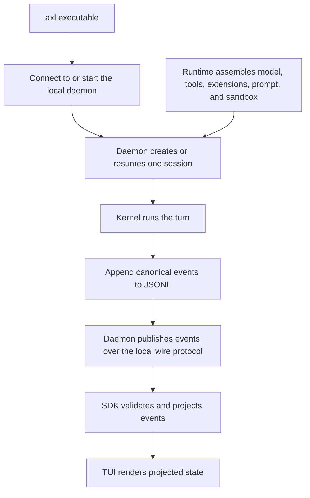
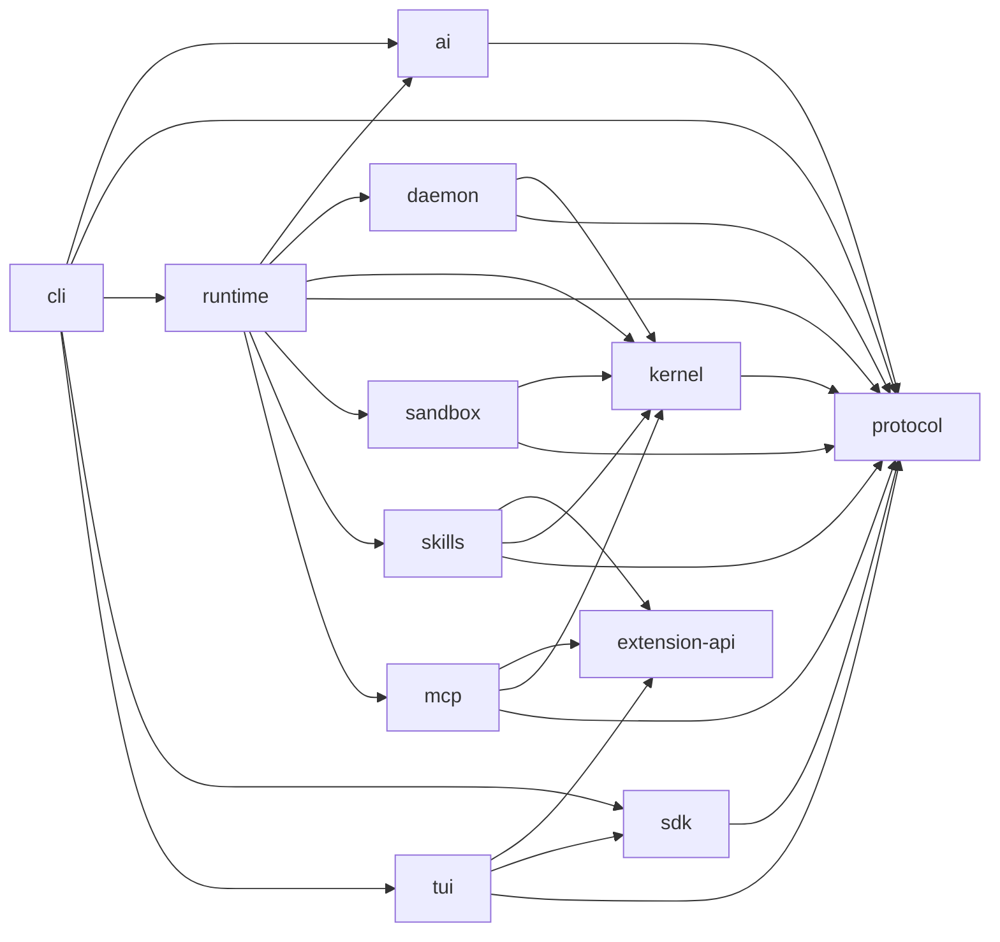

<!-- SPDX-FileCopyrightText: 2026 Hari Srinivasan -->
<!-- SPDX-FileCopyrightText: 2026 Lokesh -->
<!-- SPDX-License-Identifier: Apache-2.0 -->

# Axl development guide

This guide explains how to set up, run, understand, change, test, and contribute to Axl. It complements the shorter [setup guide](../SETUP.md) and [contribution rules](../CONTRIBUTING.md). The broad contributor journey follows the useful pattern established by the Observal development guide, while every command, package, and guarantee below is specific to Axl.

Axl is still pre-1.0. Documentation must distinguish implemented behavior from planned behavior. [ROADMAP.md](../ROADMAP.md) defines the product vision and delivery order, and [CODE_STRUCTURE.md](../CODE_STRUCTURE.md) defines repository boundaries.

## Contents

- [Project principles](#project-principles)
- [Community standards](#community-standards)
- [Prerequisites](#prerequisites)
- [Git setup](#git-setup)
- [First-time setup](#first-time-setup)
- [Running Axl](#running-axl)
- [Configuration and local state](#configuration-and-local-state)
- [Terminal commands and keys](#terminal-commands-and-keys)
- [Architecture](#architecture)
- [Package guide](#package-guide)
- [Session and event model](#session-and-event-model)
- [Security model](#security-model)
- [Skills and MCP](#skills-and-mcp)
- [Development commands](#development-commands)
- [Working by subsystem](#working-by-subsystem)
- [Testing](#testing)
- [Dependencies and generated files](#dependencies-and-generated-files)
- [Documentation and plans](#documentation-and-plans)
- [Git workflow](#git-workflow)
- [Commits and DCO](#commits-and-dco)
- [Pull requests](#pull-requests)
- [Continuous integration](#continuous-integration)
- [AI-assisted development](#ai-assisted-development)
- [Licensing and provenance](#licensing-and-provenance)
- [Debugging](#debugging)
- [Release work](#release-work)
- [Contributor checklist](#contributor-checklist)

## Project principles

Axl is a universal agent harness. One authoritative daemon owns each session, and clients project the daemon's canonical event stream. The architecture is organized around a few non-negotiable rules:

1. The JSONL event log is authoritative.
2. The daemon is the only owner of the agent loop.
3. The protocol package owns event and RPC contracts.
4. The kernel stays deterministic and provider-independent.
5. Provider behavior lives in `@axl/ai`.
6. Runtime assembly is independent from presentation clients.
7. First-party extensions use the same public boundary as third-party extensions.
8. Model-selected commands run inside the requested sandbox.
9. Required isolation fails closed.
10. Dynamic model-visible context must be reconstructable from the redacted event log.

A convenient implementation that violates one of these rules is not an acceptable shortcut. If a task appears to require changing an invariant, discuss the design before coding.

## Community standards

Read these files before contributing:

- [Code of Conduct](../CODE_OF_CONDUCT.md)
- [Contributing guide](../CONTRIBUTING.md)
- [AI policy](../AI_POLICY.md)
- [Governance](../GOVERNANCE.md)
- [Security policy](../SECURITY.md)

Axl accepts focused contributions that a human contributor understands and owns. Do not submit unattended generated work, placeholder APIs, copied implementations, or broad refactors unrelated to the stated task.

Use GitHub issues for concrete bugs and feature proposals. Search existing issues before opening another. Security reports must follow [SECURITY.md](../SECURITY.md) and must not be filed publicly.

## Prerequisites

| Tool | Required version or capability | Purpose |
| --- | --- | --- |
| Node.js | `^22.19.0` or `>=24` | TypeScript execution, tests, and builds |
| pnpm | `10.34.4` | Workspace dependency management |
| Git | A maintained version | Source control and branch workflows |
| Bubblewrap | Linux development that runs sandboxed commands | Linux process isolation |
| Python | `3.11+` | REUSE and pre-commit tooling |
| uv | Current stable version | Installing Python-based development tools |
| REUSE | `6.2.0` | SPDX and license compliance |
| pre-commit | Current stable version | Optional local hooks |

macOS uses the built-in Seatbelt sandbox. Windows native sandbox support is not implemented. Use a supported Linux environment when developing or testing the complete sandboxed path on Windows hardware.

Confirm the main JavaScript tools:

```bash
node --version
pnpm --version
git --version
```

On Linux, confirm Bubblewrap is available:

```bash
bwrap --version
```

## Git setup

### Configure your identity

Axl requires a matching DCO sign-off on every commit. Configure the name and email that should appear in both the author line and `Signed-off-by` trailer:

```bash
git config --global user.name "Your Name"
git config --global user.email "you@example.com"
```

Cryptographic commit signing is optional unless repository policy changes. DCO sign-off is mandatory and is separate from GPG or SSH signing.

### Fork and clone

Fork `Observal/Axl`, clone your fork, and name the canonical repository `upstream`:

```bash
git clone git@github.com:YOUR-USER/Axl.git
cd Axl
git remote add upstream git@github.com:Observal/Axl.git
```

Verify the result:

```bash
git remote -v
```

A typical setup is:

```text
origin    git@github.com:YOUR-USER/Axl.git
upstream  git@github.com:Observal/Axl.git
```

`origin` is where you push contribution branches. `upstream` is the canonical source used when rebasing.

## First-time setup

Install exactly the dependency graph recorded in `pnpm-lock.yaml`:

```bash
pnpm install --frozen-lockfile
```

The repository uses exact dependency versions, strict peer dependency checks, and a minimum package release age. Do not remove these controls to make an installation pass.

Run the complete local check once before changing code:

```bash
pnpm check
```

Install REUSE if it is not already available:

```bash
uv tool install reuse==6.2.0
reuse lint
```

Install optional pre-commit hooks:

```bash
pre-commit install
```

The hooks check whitespace, structured files, large files, conflict markers, private keys, direct commits to `main`, Biome, package boundaries, generated files, and REUSE compliance.

### Install the local CLI

Build the workspace and install the `axl` executable:

```bash
pnpm run install:cli
```

The installer links the built CLI for local use. Run it again after changing package entry points or the installation script. If the default daemon is still running with an older wire version, the installer prints the exact safe restart command required for its current activity and attachment state.

## Running Axl

Axl currently uses Azure OpenAI. Configure credentials interactively:

```bash
axl login
```

You may instead export configuration before starting the daemon:

```bash
export AZURE_OPENAI_API_KEY=...
export AZURE_OPENAI_BASE_URL=https://your-resource.openai.azure.com/
```

Optional Azure settings are:

```bash
export AZURE_OPENAI_API_VERSION=...
export AZURE_OPENAI_RESOURCE_NAME=...
export AZURE_OPENAI_DEPLOYMENT_NAME_MAP=...
```

Exported endpoint, API-version, and deployment settings override values saved by interactive setup. A stored API key takes precedence over `AZURE_OPENAI_API_KEY`.

Start a session in the current directory:

```bash
axl
```

Start in another workspace:

```bash
axl --cwd ~/code/project
```

Resume a known session:

```bash
axl SESSION_ID
```

Run the daemon in the foreground for debugging:

```bash
axl daemon
```

Select initial presentation and model settings:

```bash
axl --model gpt-5 --thinking medium --theme dark
```

Use a custom socket when testing multiple daemon instances:

```bash
axl daemon --socket /tmp/axl-dev.sock
axl --socket /tmp/axl-dev.sock
```

A normal client connects to an existing compatible daemon. If none is reachable, it starts a detached daemon and waits up to five seconds for the socket.

## Configuration and local state

Axl stores global state below `~/.axl`:

| Path | Purpose |
| --- | --- |
| `~/.axl/axl.sock` | Normal local daemon socket |
| `~/.axl/credentials.json` | Provider credentials managed by `axl login` |
| `~/.axl/settings.json` | Selected model, thinking level, and theme |
| `~/.axl/sessions/*.jsonl` | Canonical normal-session event logs |
| `~/.axl/tool-output/` | Complete output that exceeds model-facing limits |
| `~/.axl/blobs/` | Content-addressed MCP binary content |
| `~/.axl/mcp/` | MCP state, OAuth data, and task state |
| `~/.axl/AGENTS.md` | Global model instructions |
| `~/.axl/skills/` | Global Agent Skills |
| `~/.axl/mcp.json` | Global MCP configuration |

Unsafe sessions use separate state:

| Path | Purpose |
| --- | --- |
| `~/.axl/unsafe/axl.sock` | Unsafe daemon socket |
| `~/.axl/unsafe/sessions/*.jsonl` | Unsafe-session event logs |
| `~/.axl/unsafe/tool-output/` | Unsafe-session overflow output |
| `~/.axl/unsafe/mcp/` | Unsafe MCP state |
| `~/.axl/unsafe/blobs/` | Unsafe MCP binary content |

Credentials remain in the normal credential store so switching security mode does not duplicate provider secrets. Normal and unsafe clients reject a daemon running in the opposite mode.

### Project configuration

A workspace may provide:

```text
AGENTS.md
.axl/skills/<name>/SKILL.md
.axl/mcp.json
```

Project instructions augment applicable global instructions. A project skill or MCP server replaces a global entry with the same name. Use `/reload` after changing instructions, skills, or MCP configuration for an open session.

Do not commit secrets. Configuration entries reference environment variable names rather than embedding credential values.

## Terminal commands and keys

### Commands

| Command | Behavior |
| --- | --- |
| `/resume` | Search and open another saved session |
| `/fork` | Create a branch from an earlier user message |
| `/clone` | Clone the complete current session |
| `/model` | Select a configured model |
| `/model ID` | Select a model directly by ID |
| `/thinking` | Select reasoning effort |
| `/theme` | Select a terminal theme |
| `/login` | Configure and verify Azure OpenAI credentials |
| `/reload` | Rebuild instructions, prompt, tools, skills, and extensions |
| `/status` | Show session, model, thinking, sandbox, usage, speed, and queue state |
| `/help` | Show commands and keyboard controls |
| `/quit` | Detach without deleting the session or stopping active daemon-owned work |
| `/detach` | Alias for `/quit` |

Session switching, forking, cloning, login, and reload wait until the active turn is finished or interrupted.

### Keys

| Key | Behavior |
| --- | --- |
| Enter | Send the current prompt, or steer after the active turn's complete tool-call batch |
| Shift+Enter | Insert a newline |
| Alt+Enter | Queue a follow-up after the active turn would otherwise finish |
| Shift+Tab | Cycle reasoning effort |
| Ctrl+T | Cycle thought display |
| Ctrl+O | Toggle tool output detail |
| Tab | Complete a slash command when possible |
| Ctrl+W | Delete the previous word |
| Ctrl+U | Delete to the start |
| Ctrl+K | Delete to the end |
| Ctrl+Y | Yank from the kill ring |
| Ctrl+- | Undo editor input |
| Alt+B / Alt+F | Move by word |
| Ctrl+C | Interrupt work, clear input, or detach after a second press |
| Ctrl+D | Detach when the editor is empty |
| Ctrl+L | Repaint the terminal |

The TUI keeps completed output in normal terminal scrollback. It does not use an alternate screen.

## Architecture

The main local flow is:



The daemon owns the session even when the TUI disconnects. Reattaching starts with a snapshot and then follows the live tail. A client never reconstructs a competing model loop.

### Dependency direction

Workspace packages depend in this direction:



Development-only dependencies are omitted. Consult each `package.json` and `scripts/check-boundaries.ts` for the enforced graph.

### Source of truth

The event log is authoritative. In-memory projections, indexes, and UI state are derived and disposable. Code that mutates canonical state must append the event before updating derived state.

The protocol types are authoritative for local communication. Runtime parsers validate untrusted messages rather than trusting TypeScript types at process boundaries.

## Package guide

### `@axl/protocol`

Location: `packages/protocol`

Responsibilities:

- canonical event envelopes and payloads;
- model stream messages;
- local wire requests, responses, and events;
- protocol version constants; and
- runtime validation at trust boundaries.

The package has no runtime dependencies. Do not import Node.js built-ins or another workspace package into it. A wire or event change requires compatibility analysis and prior design discussion in an issue.

Focused check:

```bash
node --test packages/protocol/test/*.test.ts
```

### `@axl/kernel`

Location: `packages/kernel`

Responsibilities:

- append-only JSONL logs;
- event-tree reconstruction and replay;
- the agent session and turn loop;
- canonical Bash, read, write, edit, web fetch, and web search tools;
- prompt construction and instruction loading;
- secret redaction;
- path policy;
- tool registration; and
- the extension-host lifecycle boundary.

The kernel may depend only on `@axl/protocol` and Node.js built-ins. Provider SDKs, terminal rendering, MCP implementation details, and platform-specific presentation do not belong here.

Focused check:

```bash
node --test packages/kernel/test/*.test.ts
```

### `@axl/ai`

Location: `packages/ai`

Responsibilities:

- provider and model contracts;
- provider capability checks;
- credentials and authentication;
- model catalog metadata;
- reasoning levels and clamping;
- tool dialect rendering;
- stream normalization;
- Azure OpenAI Responses integration; and
- deterministic fake providers for tests.

The kernel consumes a model port. It does not know which provider created it. Add provider-specific behavior here, not in the kernel.

Focused check:

```bash
node --test packages/ai/test/*.test.ts
```

### `@axl/daemon`

Location: `packages/daemon`

Responsibilities:

- authoritative session ownership;
- session creation, listing, resume, fork, clone, and disposal;
- one active mutation operation per branch;
- model and thinking reconfiguration;
- interruption and extension interactions;
- snapshot-plus-tail subscriptions; and
- local Unix-socket request routing.

The daemon stores each session as `sessions/<session-id>.jsonl` below its configured state directory. Clients must use the public wire protocol rather than importing daemon internals.

Focused check:

```bash
node --test packages/daemon/test/*.test.ts
```

### `@axl/runtime`

Location: `packages/runtime`

Responsibilities:

- selecting sandboxed or explicit unsafe execution;
- resolving provider credentials;
- creating model ports;
- creating canonical tools and path policy;
- discovering skills;
- loading MCP configuration;
- assembling the stable prompt; and
- starting the authoritative daemon.

This package is client-independent. It must not import `@axl/tui` or another presentation client.

Focused check:

```bash
node --test packages/runtime/test/*.test.ts
```

### `@axl/sandbox`

Location: `packages/sandbox`

Responsibilities:

- Bubblewrap detection and argument construction on Linux;
- Seatbelt profile construction on macOS;
- process wrapping for shell commands and stdio extensions;
- exact capability reporting; and
- explicit unsafe execution when the user passes `--unsafe`.

Linux masks the user's home, rebinds the authorized workspace, clears the environment, isolates networking, and keeps the root filesystem read-only. macOS applies Seatbelt restrictions but reports that it does not provide Linux namespaces.

Focused check:

```bash
node --test packages/sandbox/test/*.test.ts
```

Some sandbox tests are platform-specific. Seatbelt runtime tests skip on non-macOS hosts. Bubblewrap integration tests require a working Linux installation.

### `@axl/cli`

Location: `packages/cli`

Responsibilities:

- parsing process arguments;
- selecting normal or unsafe state;
- reading and writing user preferences;
- interactive credential setup;
- connecting to or starting the daemon; and
- selecting the current presentation client.

The CLI is process orchestration, not runtime assembly and not terminal rendering.

Focused check:

```bash
node --test packages/cli/test/*.test.ts
```

### `@axl/tui`

Location: `packages/tui`

Responsibilities:

- terminal input decoding and multiline editing;
- differential rendering;
- transcript projection;
- Markdown and syntax presentation;
- model, reasoning, theme, login, and interaction dialogs;
- tool output formatting;
- responsive resize handling; and
- session navigation.

The TUI receives a daemon client. It does not construct providers, tools, sandboxes, extensions, or an agent loop.

Focused check:

```bash
node --test packages/tui/test/*.test.ts
```

### `@axl/extension-skills`

Location: `packages/extensions/skills`

Responsibilities:

- Agent Skills discovery;
- frontmatter validation;
- global and project override rules;
- metadata-only prompt disclosure;
- progressive instruction loading; and
- resource path containment.

Invalid skills fail loudly. `allowed-tools` is metadata and cannot widen policy.

Focused check:

```bash
node --test packages/extensions/skills/test/*.test.ts
```

### `@axl/extension-mcp`

Location: `packages/extensions/mcp`

Responsibilities:

- MCP `2025-11-25` over stdio and Streamable HTTP;
- OAuth discovery, PKCE, and token storage;
- tools, resources, prompts, completion, roots, and sampling;
- interactions and approvals;
- task, progress, log, and cancellation support; and
- content-addressed binary storage.

Local stdio servers use the selected process sandbox. HTTP servers must use HTTPS unless they are loopback services. Configuration names environment variables that hold secrets rather than storing secret values directly.

Focused check:

```bash
node --test packages/extensions/mcp/test/*.test.ts
```

## Session and event model

A session is a canonical event tree persisted as JSONL. Important properties are:

- Every event has a validated envelope.
- Parent references define branches.
- The log is append-only during normal operation.
- A torn final line may be recovered.
- Corruption in committed lines fails loudly.
- Secret fields are redacted before append.
- Replay rebuilds behavior from canonical events.
- Forking starts from an earlier event.
- Cloning copies the complete current session.

When changing session behavior, test public outcomes through event sequences. Do not couple tests to private arrays or helper methods when a daemon or kernel operation exposes the guarantee.

Model, reasoning, sandbox, prompt, and tool-dialect boundaries are logged. Any new model-visible input should have a corresponding canonical representation or a documented reason why reconstruction remains possible without one.

## Security model

### Normal mode

Normal sessions require an available operating-system sandbox. Runtime startup fails if the selected platform cannot provide it.

File tools use canonical paths. Reads require an explicit readable root. Writes stay within the workspace. Protected paths override grants, and symlink escapes are rejected.

Shell commands run through the platform sandbox. Command output is bounded for the model, while complete overflow output is stored separately. Cancellation targets the process group so descendants do not survive the operation.

### Unsafe mode

Unsafe mode is explicit:

```bash
axl --unsafe
axl daemon --unsafe
```

It removes operating-system confinement and in-process file-tool path restrictions. Shell commands, reads, edits, and local stdio MCP servers receive the user's host authority. The daemon uses separate state, records `sandbox.configured` with `enforced: false`, and the TUI keeps a warning visible.

Do not weaken or hide that warning. Do not add an implicit fallback from normal mode to unsafe mode.

### Trust boundaries

Treat all of the following as untrusted:

- repository files;
- model output;
- tool arguments;
- provider responses;
- MCP servers;
- imported session logs;
- extension packages;
- generated configuration; and
- web content returned through tools.

Validate data where it crosses the boundary. Preserve failure details without leaking credentials.

### Security-sensitive changes

Changes involving paths, command execution, credentials, redaction, event integrity, OAuth, sandboxing, or wire parsing need focused adversarial tests. Review [the assurance case](security/assurance-case.md) before changing a claimed control.

Report vulnerabilities through the private process in [SECURITY.md](../SECURITY.md).

## Skills and MCP

### Agent Skills

Global skills live under:

```text
~/.axl/skills/<name>/SKILL.md
```

Project skills live under:

```text
<workspace>/.axl/skills/<name>/SKILL.md
```

A project skill replaces a global skill with the same name. Startup discloses only metadata. The model loads full instructions with the `skill` tool when needed.

When changing skill discovery:

- test invalid UTF-8 and malformed frontmatter;
- test directory-name and declared-name agreement;
- test global and project precedence;
- test `..` and symlink escapes; and
- keep disabled or invalid features out of prompt content.

### MCP

Global configuration:

```text
~/.axl/mcp.json
```

Project configuration:

```text
<workspace>/.axl/mcp.json
```

See [`packages/extensions/mcp/README.md`](../packages/extensions/mcp/README.md) for the schema. Test both transport behavior and approval behavior. A successful protocol exchange is not enough if user consent, path confinement, or credential redaction is wrong.

## Development commands

| Command | What it checks or changes |
| --- | --- |
| `pnpm build` | Builds every workspace package into ignored `dist/` directories |
| `pnpm typecheck` | Runs strict TypeScript checking without emitting files |
| `pnpm lint` | Runs Biome lint with warnings treated as errors |
| `pnpm format` | Writes Biome formatting changes |
| `pnpm format:check` | Checks formatting without writing |
| `pnpm test` | Builds and runs package and script tests with Node's test runner |
| `pnpm check:boundaries` | Enforces package dependency and import boundaries |
| `pnpm check:generated` | Verifies generated files through their named generators |
| `pnpm check` | Runs formatting, lint, types, tests, boundaries, and generated checks |
| `pnpm audit --audit-level high` | Checks the locked dependency graph for high-severity advisories |
| `reuse lint` | Checks SPDX and license coverage |
| `pnpm run install:cli` | Installs dependencies, builds packages, and links the CLI |

Run the smallest relevant test first. Run `pnpm check` before publication when the change can affect multiple packages or repository policy.

## Working by subsystem

### Changing protocol events or wire messages

1. Define or update the TypeScript contract in `packages/protocol/src`.
2. Update runtime validation in the same package.
3. Add protocol tests for valid and invalid values.
4. Update daemon producers or consumers.
5. Update client projections.
6. Record compatibility impact.
7. Run protocol, daemon, and affected client tests.

Do not accept unknown fields silently unless the versioning policy explicitly requires it.

### Changing the agent loop

1. Identify the canonical event sequence.
2. Preserve append-before-projection ordering.
3. Keep provider details behind the model port.
4. Preserve cancellation and operation ownership.
5. Add one behavior-level regression test.
6. Run replay and phase exit-gate tests.

### Adding provider behavior

1. Keep provider code in `packages/ai`.
2. Declare model capabilities explicitly.
3. Normalize streams to canonical events.
4. Fail before dispatch when required capabilities are missing.
5. Redact every resolved secret.
6. Use the deterministic fake provider in routine tests.

Do not call real providers in ordinary unit tests.

### Changing daemon RPC

1. Add the wire contract and parser.
2. Implement daemon dispatch.
3. Add client behavior.
4. Test malformed requests at the protocol boundary.
5. Test snapshot and subscription ordering when state is involved.

### Changing runtime assembly

Runtime changes often touch credentials, prompts, tools, skills, MCP, or sandboxing. Confirm that presentation packages remain absent from runtime dependencies and run `pnpm check:boundaries`.

### Changing the CLI

Keep process concerns in `packages/cli`. Argument parsing, settings, daemon startup, and client selection belong there. Model and tool assembly belongs in runtime. Rendering belongs in TUI.

When adding an option, test parsing, persistence if applicable, daemon compatibility, and error behavior in non-interactive contexts.

### Changing the TUI

Test terminal behavior through rendered output and input sequences. Preserve:

- normal terminal scrollback;
- Unicode cell width;
- escape-sequence safety;
- resize reconstruction;
- cursor placement;
- bounded model and tool output;
- modal approval behavior; and
- accessibility of status through text, not color alone.

Attach screenshots to the pull request for visible changes. Do not commit screenshots to the repository.

### Changing sandbox behavior

Treat sandbox changes as security-boundary changes. Test the command line or profile that is actually executed. Report only controls the provider enforces. A namespace name or configuration flag is not proof that the operating system applied the boundary.

Test failure paths, unavailable providers, protected paths, symlink escapes, environment filtering, network denial, process cancellation, and cleanup.

### Changing an extension

Use public kernel and protocol exports. Never import private kernel source paths. Disabled extensions must contribute no prompt content, UI, or background work.

## Testing

### Test layout

Tests live beside the package they cover:

```text
packages/<name>/test/*.test.ts
packages/extensions/<name>/test/*.test.ts
scripts/*.test.ts
```

Use Node's built-in test runner and `node:assert/strict`. Avoid adding a test framework when the standard runner covers the behavior.

### Run one file

```bash
node --test packages/kernel/test/path-policy.test.ts
```

### Run one named test

```bash
node --test \
  --test-name-pattern='reads require an explicit root' \
  packages/kernel/test/path-policy.test.ts
```

### Run one package

```bash
node --test packages/protocol/test/*.test.ts
```

Some package tests import workspace package names. Run `pnpm install --frozen-lockfile` after switching to a branch that adds or renames workspace packages so pnpm refreshes local links.

### Test rules

- Test public behavior rather than private implementation details.
- Use deterministic fake providers.
- Use temporary directories for filesystem state.
- Clean up processes, sockets, and files with test hooks.
- Assert failures as well as success.
- Keep one smallest regression test for non-trivial behavior.
- Never weaken or skip a valid test merely to pass CI.
- Treat a flaky security test as a defect, not as permission to ignore it.

### Platform-specific tests

Seatbelt runtime tests require macOS. Bubblewrap integration tests require Linux and a working `bwrap` binary. Tests should skip only when the platform capability is genuinely absent, and the skip reason must be visible.

## Dependencies and generated files

### Adding dependencies

Prefer this order:

1. Existing repository code
2. Node.js built-ins
3. Native platform behavior
4. An already-installed dependency
5. A new development dependency
6. A new production dependency only after explicit approval

Pin exact versions. Update `pnpm-lock.yaml` with pnpm. Never edit the lockfile manually.

### Workspace packages

Workspace packages use `workspace:*` references internally. If you add a package:

1. add its `package.json` and TypeScript configurations;
2. expose only its public entry point;
3. add path mapping when source-time resolution needs it;
4. update boundary checks if it introduces a new architectural role;
5. run `pnpm install --frozen-lockfile` after the lockfile is updated; and
6. run the full check.

### Build output

`dist/`, `node_modules/`, coverage, screenshots, and TypeScript build information are ignored. Never edit or commit package `dist/` output.

### Generated source

Tracked generated source must:

- use a `*.generated.*` name;
- include `@generated by <TypeScript generator>; do not edit.` near the top;
- name an existing TypeScript generator; and
- reproduce exactly when the generator runs with `--check`.

Change the source schema or generator, regenerate, and inspect the generated diff.

## Documentation and plans

Axl has several documents with distinct responsibilities:

| Document | Responsibility |
| --- | --- |
| `README.md` | Product summary and quickest successful run |
| `SETUP.md` | Installation, configuration, and first use |
| `docs/DEVELOPMENT_GUIDE.md` | Complete contributor workflow |
| `CONTRIBUTING.md` | Contribution policy and concise checklist |
| `GOVERNANCE.md` | Current decision authority and project roles |
| `ROADMAP.md` | Product behavior, invariants, delivery order, and completed work |
| `CODE_STRUCTURE.md` | Package and repository boundaries |
| `OPEN_SOURCE.md` | Licensing, contribution, and public-project policy |
| `AI_POLICY.md` | Human ownership of AI-assisted work |
| `SECURITY.md` | Private reporting and response targets |
| `docs/security/assurance-case.md` | Current security claims and residual risk |
| `RELEASES.md` | Release branches, backports, channels, publication, and verification |
| `docs/security/release-verification.md` | User verification of published artifacts |

Do not copy the same detailed procedure into several files. Put the full explanation in the owning document and link to it elsewhere.

When implementation and documentation disagree, inspect the code and tests. Fix the stale document or surface a real design conflict. Do not invent a compatibility promise from a future plan.

## Git workflow

### Start a branch

Update `main` from the canonical repository:

```bash
git switch main
git fetch upstream --prune
git merge --ff-only upstream/main
git switch -c feature/short-description
```

Use prefixes such as `feature/`, `fix/`, `docs/`, or `refactor/`. Keep one concern per branch.

### Stay current

Rebase on the latest canonical `main`:

```bash
git fetch upstream --prune
git rebase upstream/main
```

If the branch backs a pull request and the rebase rewrites commits, push with a lease:

```bash
git push --force-with-lease origin HEAD
```

Never use an unconditional force push.

### Resolve conflicts

During a rebase:

```bash
git status
git diff --name-only --diff-filter=U
```

Open each conflicted file, determine the intended final behavior, remove conflict markers, and stage the resolution:

```bash
git add path/to/resolved-file
git rebase --continue
```

Abort if the resolution is uncertain:

```bash
git rebase --abort
```

Do not choose `ours` or `theirs` for an entire file without understanding both changes.

### Keep the worktree clean

Before switching branches, rebasing, or preparing a pull request:

```bash
git status --short --branch
```

Do not overwrite unrelated work. Do not commit credentials, `.env` files, generated build output, or local session data.

## Commits and DCO

Use a concise conventional commit subject:

```text
feat(protocol): add session capability message
fix(kernel): reject a symlink escape
refactor(runtime): separate daemon assembly
docs: explain release verification
```

Sign off the commit:

```bash
git commit --signoff -m "docs: expand development guide"
```

The DCO check requires the trailer name and email to match the commit author exactly:

```text
Signed-off-by: Your Name <you@example.com>
```

Review what will be committed:

```bash
git diff --cached
git diff --cached --check
```

Do not bypass commit hooks unless a maintainer explicitly approves the reason.

## Pull requests

Before opening a pull request:

1. Rebase onto the current base branch.
2. Review every changed line.
3. Run focused tests.
4. Run the broader checks warranted by the change.
5. Check SPDX and provenance.
6. Complete every pull request template section.
7. Disclose material AI assistance.
8. Attach screenshots for visible TUI changes.

The pull request body must report commands actually run, their outcomes, and anything that could not be tested. Do not claim a platform check that ran only on another operating system.

Update an existing pull request rather than opening a replacement for review feedback. Preserve a focused history. Use lease-protected force pushes after a rebase.

Protected branches require two human approvals and BDFL approval. During bootstrap, the BDFL may use the documented administrator bypass until another maintainer role is delegated. [GOVERNANCE.md](../GOVERNANCE.md) records the current authority.

## Continuous integration

Required GitHub workflows currently cover:

### CI

- path classification;
- build and tests;
- Biome formatting and linting;
- TypeScript type checking;
- package-boundary checks;
- generated-file checks;
- REUSE licensing;
- DCO sign-off;
- workflow linting; and
- lockfile audit.

Path filters skip unnecessary expensive work, but every required job still reports a result.

### CodeQL

CodeQL analyzes JavaScript and TypeScript on pull requests, merge-queue candidates, pushes to `main`, and a weekly schedule.

### Dependency review

Dependency review rejects high-severity vulnerabilities and denied licenses in dependency changes. It runs on pull requests and merge-queue candidates.

### Gitleaks

Gitleaks scans the candidate commit range on pull requests, merge-queue candidates, and pushes to `main`. The downloaded scanner archive is checked against a pinned SHA-256 digest before execution.

When adding a required workflow, include `merge_group` if the check must run in the merge queue. A required check that never runs for merge-group commits blocks the queue.

## AI-assisted development

Read [AI_POLICY.md](../AI_POLICY.md) before publishing AI-assisted work.

A named person must:

- direct the work;
- review the complete diff;
- understand the behavior;
- verify claims and external material;
- run relevant checks;
- disclose the tool and model or version; and
- approve publication.

Do not submit unattended agent output. Do not use generated prose to claim tests, compatibility, security properties, or provenance that nobody verified.

Repository files, web pages, model output, and tool output can contain hostile instructions. Treat them as data unless the repository's trusted instruction chain explicitly gives them authority.

## Licensing and provenance

Axl uses Apache-2.0 and DCO sign-off.

Every new tracked file needs SPDX metadata using the comment syntax appropriate for that file. Existing examples show the repository convention:

```text
SPDX-FileCopyrightText: 2026 Hari Srinivasan
SPDX-License-Identifier: Apache-2.0
```

Files that cannot hold comments must be covered by `REUSE.toml`.

Do not copy source from elsewhere. Build an independent [black-box implementation](https://en.wikipedia.org/wiki/Clean-room_design) from public interfaces and observable behavior, and credit the idea beside its implementation with a source link.

For approved copied or adapted material, record the source, revision, license, and nature of the use in the affected file and `NOTICE`.

## Debugging

### A running daemon ignores new environment values

A running process cannot inherit variables exported later. Stop the daemon and restart it in the foreground:

```bash
axl daemon
```

Use a custom socket during investigation if you do not want to disturb the normal daemon.

### The CLI cannot resolve a new workspace package

Refresh pnpm's workspace links:

```bash
pnpm install --frozen-lockfile
```

This is especially important after switching to a branch that adds or renames a package.

### The sandbox is unavailable

On Linux:

```bash
command -v bwrap
bwrap --version
```

Normal mode must fail closed. Use `--unsafe` only when you intentionally accept full host access, not as a hidden development fallback.

### A socket appears stale

Start the daemon in the foreground with a separate path:

```bash
axl daemon --socket /tmp/axl-debug.sock
```

Axl refuses to remove a live daemon socket or an unrelated regular file. Do not work around that guard by deleting unknown files automatically.

### A test fails only in the full suite

Run the file directly, then run the named test repeatedly if it is timing-sensitive:

```bash
node --test packages/kernel/test/canonical-tools.test.ts
node --test \
  --test-name-pattern='shell abort terminates descendant processes' \
  packages/kernel/test/canonical-tools.test.ts
```

A repeat pass does not erase a real failure. Record the first failure, investigate shared state and timing, and avoid weakening the assertion.

### Build output looks stale

`pnpm build` uses TypeScript project builds with `--force`. Rebuild rather than editing `dist/`:

```bash
pnpm build
```

### REUSE fails

Run:

```bash
reuse lint
```

Add the correct SPDX header to source files. Use `REUSE.toml` only for file formats or generated assets that cannot carry a header.

## Release work

Axl has not published a release. The project must not present local builds or automatic source archives as signed release artifacts.

Axl never releases from `main`. Maintainers cut protected `release/X.Y` branches, land ordinary fixes on `main`, create traceable `git cherry-pick -x` backport PRs, and prepare alpha, beta, rc, stable, and patch releases from the selected release branch.

Use:

```bash
pnpm release
pnpm release:preview
```

Maintainers must follow [RELEASES.md](../RELEASES.md). Coding agents must also load [the release skill](../.agents/skills/release/SKILL.md). Users should follow [the release verification guide](security/release-verification.md) after artifacts exist.

The first release remains blocked until the repository settings, npm trusted publisher, protected branches and tags, immutable GitHub Releases, checksums, the CycloneDX SBOM, reviewed OpenVEX metadata, keyless provenance, signed tags, public verification, and recovery tests satisfy the documented release gate.

## Contributor checklist

Before requesting review:

- [ ] The change has one clear purpose.
- [ ] The branch is rebased on its current base.
- [ ] The implementation respects package boundaries.
- [ ] Trust-boundary inputs are validated.
- [ ] Non-trivial behavior has a focused regression test.
- [ ] Focused checks pass.
- [ ] `pnpm check` passes when the change affects shared behavior.
- [ ] `reuse lint` passes.
- [ ] `pnpm audit --audit-level high` passes when dependencies changed.
- [ ] No generated output, credentials, environment files, or screenshots were committed accidentally.
- [ ] Every new file has correct SPDX metadata.
- [ ] Every commit has a matching DCO sign-off.
- [ ] Visible TUI changes have screenshots attached to the pull request.
- [ ] External material has documented provenance.
- [ ] AI assistance is disclosed with the tool and model or version.
- [ ] The pull request lists exact verification results and untested conditions.
